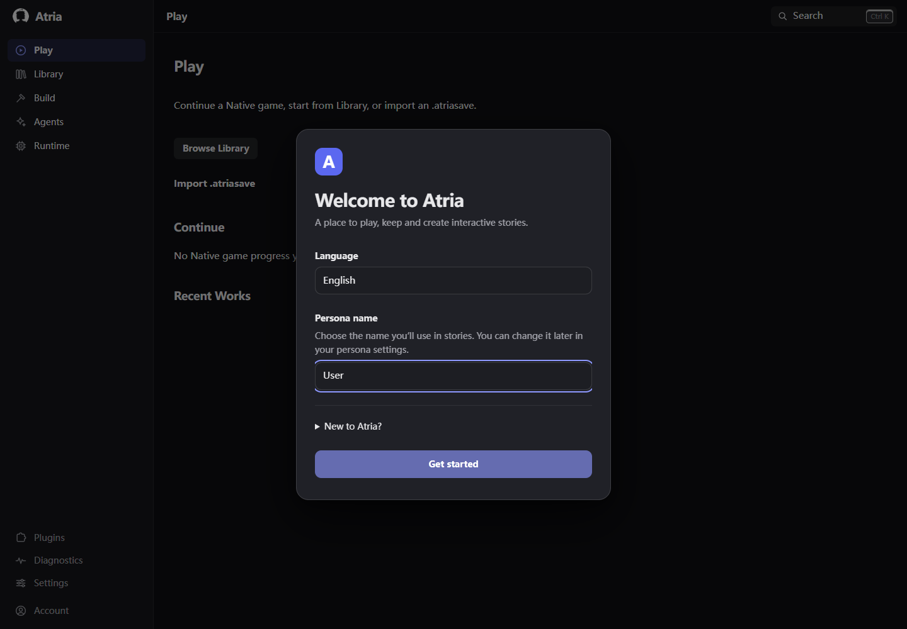
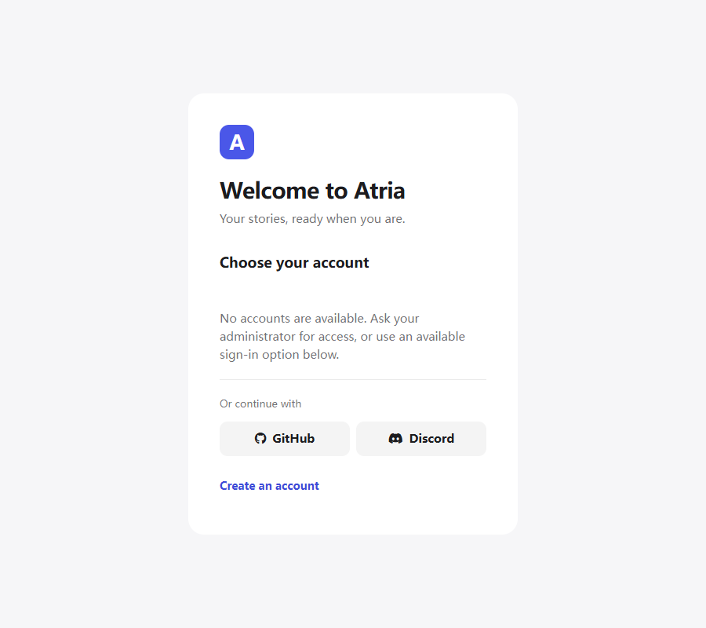
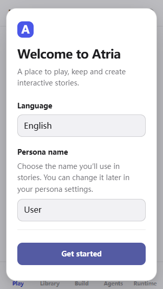
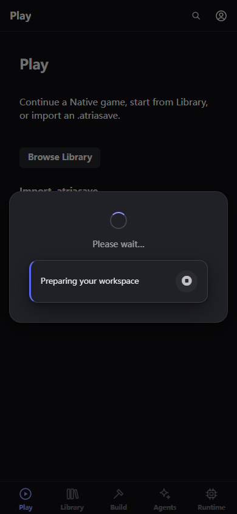
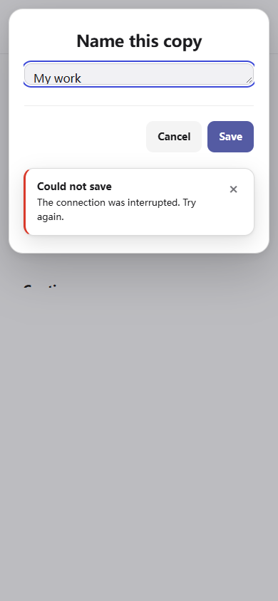
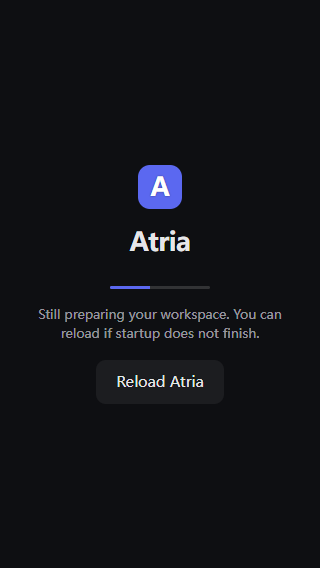

# Frontend redesign — Phase 2 complete

- Date: 2026-09-24
- Repository: `ZZZdragondYNGPHX/Atria`
- Branch: `refactor/atria-product-frontend-redesign`
- Verified live baseline: `402b53a98a823573591db4e9fd015f98e6effbdb`
- Implementation HEAD: `dfb022700f688c6e6616003a764cf3a5855ed129`
- State: committed and pushed; **not merged into main**.
- Checkpoint: Phase 2 only. Stop; Phase 3 requires the user's continuation.

## Delivered

Rebuilt the login document as an identity surface with native account buttons,
labeled sign-in/registration/recovery forms, OAuth entries, empty/error/retry
states, request locking, feedback and retained destination handling. The login
page consumes the existing appearance and responsive environment modules.

Replaced the empty first-paint cover with mark/progress/status and a delayed
reload action. Startup retains its existing removal authority and now contains
legacy overflow even when the module graph cannot load.

Recomposed onboarding around language and persona name, retained persona and
first-run persistence, preserved the locale-change handler when cloning the
welcome content, and added blank-name feedback and Chinese translations.

Refactored the common Popup controls to native buttons without changing result
or lifecycle contracts. Fixed duplicate Enter activation caused by the legacy
global keyboard handler, associated accessible names after mounting, and added
Environment-driven viewport constraints with lifecycle cleanup.

Default blocking loading uses a content-sized surface and native keyboard stop
control. Fixed the asynchronous cleanup race: a closing popup cannot remove a
replacement operation's overlay. Custom overlay sizing is preserved. Toasts use
Atria surfaces and explicit dismiss buttons; modal notices occupy layout space
instead of obscuring fields. Loader notices retain their stop semantics.

Per the user's explicit mid-task instruction, retired SillyTavern migration:
onboarding controls, upload helpers, styles, the three dedicated import routes,
and the server-only ZIP importer. Atria's own backup/restore and storage-engine
migration remain supported. Existing backup mismatch coverage remains on the
restore endpoint; retired routes now have 404 assertions.

## Architecture and presentation decisions

No new router, preference store, configuration authority or runtime state was
introduced. Native Session, generation ABI, Stage/recovery, WorkspaceHost,
Studio/ChangeSet, Runtime and plugin authority paths are unchanged. Shell and
Native ownership browser regression still pass. Recovery mode retains its legacy
popup styling; shared native button semantics remain accessible there too.

Presentation hooks removed: login's old `shadow_popup`/`dialogue_popup` scaffold,
the onboarding migration structure and styles. Login controller IDs remain.
The onboarding language clone has a unique label/control ID; its existing locale
handler is copied. No existing behavior guard was deleted to accommodate styling.

## Validation actually executed

- Targeted Jest: **6 suites / 43 tests passed** — startup loader, module preload,
  Popup lifecycle, popup regression, backup roundtrip parity (fs + SQLite), and
  administrator/storage migration tests including retired API assertions.
- Shell Jest: **24 suites / 96 tests passed**.
- Aggregate `check-p8-model-prompt-integration.mjs`: **passed**, including P0–P7,
  A0–A9 and N9/N10 ownership/residual checks.
- Root `npm run lint`: **passed**. Targeted lint for new/changed browser and
  endpoint tests: **passed without warnings**. `git diff --check`: **passed**.
- Cold frontend webpack compilation into a fresh isolated data root: **passed**.
- Edge Playwright entry acceptance: **9 passed**, with its own isolated local
  server/data root. Covers keyboard account selection; failed login; recovery;
  registration validation; retry; empty accounts; OAuth target; pending duplicate
  prevention; successful redirect preservation; real first-run controller;
  nested dialogs/custom actions/Escape/focus; blocking handles and replacement
  cleanup; keyboard stop; first paint/stalled startup; simulated keyboard height,
  safe areas, reduced motion and modal toast dismissal.
- Existing Edge foundation/navigation suites: **13 passed**. Includes compact,
  medium, expanded, 320px, Back/Forward, command, inspector, keyboard shrink,
  Native ABI remount identity, Full/Hybrid ownership and legacy Library forwarding.
- Actual screenshots inspected at **1440, 900, 390 and 320px**, dark/light,
  desktop/medium/compact; startup, stalled startup, login error/empty/pending,
  registration, onboarding, dialogs, blocking loader and modal notification.
  Horizontal overflow checks pass. Selected final evidence is in `phase-2-images/`.

Browser inspection caught and led to fixes for detached-template jQuery insertion,
incorrect pre-mount field labels, duplicate native Enter activation, startup
horizontal overflow, inherited full-height loading geometry and stale loader
cleanup. Screenshots were recaptured after fixes. Windows Shell tests initially
could not find `cp`; rerun with the existing Git tools on PATH passed. No product
change or skipped guard was used to mask this environment issue.

The first entry iterations used a dedicated live server and deterministic API
responses. Final entry acceptance booted its own isolated server. Authentication
failure/success/provider responses are deliberately mocked to exercise the real
frontend controller without external account credentials; this is not a claim of
live GitHub/Discord authentication.

## Limits and next phase

No Android/Termux hardware, real IME, live external OAuth or generation provider,
Docker builds, MySQL/Postgres services, or whole-repository test suite were run.
Keyboard and safe-area validation uses browser simulation plus real page rendering.
No data migration was performed. Main is unchanged. Phase 3–8 remain outstanding.

Next: **Phase 3 — Play and Native Game** on the same branch, only after the user
says continue. Read live docs and the actual branch state; do not recreate the
branch from main and lose Phase 2. Preserve Native Session/generation ABI and
Stage/transient/recovery ownership. Do not redo Phase 1 or Phase 2.

## Visual evidence

