# Frontend redesign — Phase 3 complete

- Date: 2026-09-24
- Repository: `ZZZdragondYNGPHX/Atria`
- Branch: `refactor/atria-product-frontend-redesign`
- Main verified after fetch: `402b53a98a823573591db4e9fd015f98e6effbdb`
- Starting branch HEAD: `dfb022700f688c6e6616003a764cf3a5855ed129` (Phase 2)
- Implementation HEAD: `27a61893a285365c4c42e7ac21bd4263227afc5b`
- State: committed and pushed; **not merged into main**.
- Completed: Phases 1–3. Outstanding: Phases 4–8.
- Stop here. Phase 4 requires continuation; retain this work branch.

## Delivered

Play landing now has a typographic introduction, Continue cards with dependency
feedback, a stable-id work shelf, Library navigation, save import and designed
loading/empty/error/retry states. Reads/actions reuse nativeProductClient and
WorkspaceHost. No new catalog, session store or routing layer was introduced.

The active session combines a quiet identity/control bar, reading-width prose,
tonal player turns and a growing composer. Keyed transcript reconciliation keeps
committed nodes and reading position during draft streaming; Jump to latest
restores following explicitly. Drafts remain transient. Enter/IME and Ctrl/Cmd+
Enter are distinguished. Send/Stop retain the existing Native ABI. History and
failure states expose existing open/reload recovery operations.

Timeline & Saves and Context reuse the actual Shell Dock/compact Sheet. Requests
cannot overwrite a newer Context panel. Focus returns to the initiating control
and the Shell toggle can reopen inspector content. More dismisses on outside
interaction, action and Escape. Save/import inputs use Phase 2 Popup instead of
browser prompts. Pending/result/error feedback accompanies actions. Exact
dependency preflight and immutable save conflicts remain enforced; conflicts now
explain the problem instead of showing a bare HTTP status.

Native Game sidebars mount in the inspector; modal/drawer anchors use native
dialogs with Close, focus/Escape, measured viewport limits and conservative form
defaults. Full Game retains its exact stage lease and a separate host-owned
recovery panel below the toolbar, with pending/error feedback and focus restoration.
Package content and plugin resources remain under their existing owners.

Play CSS is extracted from `atria-shell.css` into `atria-play.css`. Shell still
owns layout-critical stage/ABI isolation. Chinese text is included. Small adjacent
fixes integrate More/Game dialogs into existing Escape/Back ordering, trap keyboard
focus in compact Sheet, and prevent a dismissed toast from being revived by
pointer re-entry during its fade.

## Architecture and test decisions

Native Session, Native generation ABI, Stage/transient/recovery ownership,
Navigation Authority, WorkspaceHost, exact Library resources and Runtime model /
connection / route / generation / prompt authority remain in place. No server
authority, persistence, configuration or Studio execute/review boundary changed.
SillyTavern migration remains retired as requested in Phase 2.

The old Game browser file called deleted `activateGamePackageUi` / CardApp APIs.
It now exercises the current Structured Native Experience Runtime. It still checks
Component, Hybrid native-slot identity, Full stage/recovery isolation, Immersive,
Escape/command ordering, malformed-component cleanup and all Native ABI nodes at
desktop and compact widths. N10 now calls current `openBuild` and Build selectors.
Presentation text/More/Details assertions were updated; behavior guards retained.

## Validation actually executed

- Jest: **65 suites / 290 tests passed**, roots `atria-shell` and `game-runtime`.
  Added transcript identity/scroll/draft ownership, IME/modifier send and recovery
  authority coverage; existing Shell/Game ownership tests also pass.
- `node scripts/check-p8-model-prompt-integration.mjs`: **passed**, including
  P0–P7, A0–A9, N9/N10 exact-read/ownership/residual checks.
- Root `npm run lint`: **passed**. Targeted lint for every changed test and final
  touched product modules: **passed**. `git diff --check`: **passed**.
- Cold `scripts/prebuild-frontend-cache.js` into a fresh isolated data root:
  **passed**, cache miss followed by webpack compilation, `source=compiled`.
- Edge Playwright, **35 distinct scenarios passed** across targeted runs:
  - New Play acceptance: **8**. Landing retry/empty/start/resume, committed story
    and streamed projection, autogrow/IME, Save, inspector race/error/focus, 320px
    light/safe-area/keyboard, native Game modal, Full recovery, history, missing
    generation route, invalid archive, conflict preservation, real export/import
    into an empty isolated target, Chinese/large text/landscape.
  - Current Structured Game: **2**, at 1440 and 390px.
  - Native Play P4 generation: **2**, at 1440 and 390px; local pipeline with mock
    provider, streaming and Stop without committing the stopped draft.
  - Existing Native product N10 browser workflow: **1**.
  - Existing Shell foundation/navigation: **13**.
  - Phase 2 entry: **9**, rerun after the toast correction, including deterministic
    pointer re-entry during dismissal.
- After visual fixes, Game modal and portable-save/error scenarios passed again
  and screenshots were recaptured. Repeats are not added to the 35-scenario count.

Tests started actual isolated local servers and loaded the real product with
Playwright/installed Edge. Windows tests use Git's existing `cp` via PATH and the
test workspace's Playwright runner. New Play acceptance stubs unrelated Horde
discovery and disables the image extension so external provider availability does
not gate startup. Native resources/saves use the real local server and exact
revisions. Synthetic draft events test projection; separate P4 tests cover the
generation pipeline.

## Visual and interaction review

Used frontend-design as visual lead within DESIGN, ui-ux-pro-max for completeness,
actual browser screenshots, web-design-guidelines for implementation audit, and
emil-design-eng for interaction polish.

| Before / finding | After / correction |
| --- | --- |
| Flat controls and framed transcript; rendering disrupted reading | Slim bar, unboxed prose, stable nodes and explicit following |
| Duplicate inspector headings; stale Timeline request | One Shell heading and request ordering |
| 320px double inset and crowded actions | Compact gutters and primary/More arrangement |
| Light Send icon and unstyled error action lost contrast | Correct token specificity and Atria button treatment |
| Unstyled Game input was white on white in dark appearance | Low-specificity readable defaults; keyboard screenshot recaptured |
| Recovery overlapped the global toolbar | Host layer below toolbar, outside package content |
| Focus remained on hidden More content or escaped compact Sheet | Visible-trigger restoration and Tab wrapping |
| Toast revived during pointer re-entry | Hover-resume handlers removed after explicit close; regression passes |

Inspected actual screenshots at **1440, 900, 390, 375 and 320px**, plus **740×375
landscape**, dark/light, 20px user font scale, reduced motion, simulated visual
keyboard and safe areas. Checked overflow and composer/dialog bounds on the real
rendered page. Selected evidence is below; other snapshots remain local test artifacts.

## Limits and next phase

No physical Android/Termux, real-device IME, external model service, Docker,
Android build, MySQL/Postgres matrix or whole-repository suite was run. Keyboard
and safe areas are simulated. Game validation uses a seeded Structured model and
host fixtures, not every third-party package. Narrative remains safe plain-text
projection as before; no new Markdown/content execution contract. P4 uses a local
mock provider; live credentials are not claimed.

No known unfinished Phase 3 implementation item remains. Main stays at Phase 1;
Phases 2–3 remain together on the work branch. Next after continuation:
**Phase 4 — Library**, covering Works/details, Sessions, Worlds, Knowledge, prompt
resources and Skills while preserving exact identity and existing controllers.
Do not redo Phases 1–3 or start later domains early.

## Visual evidence

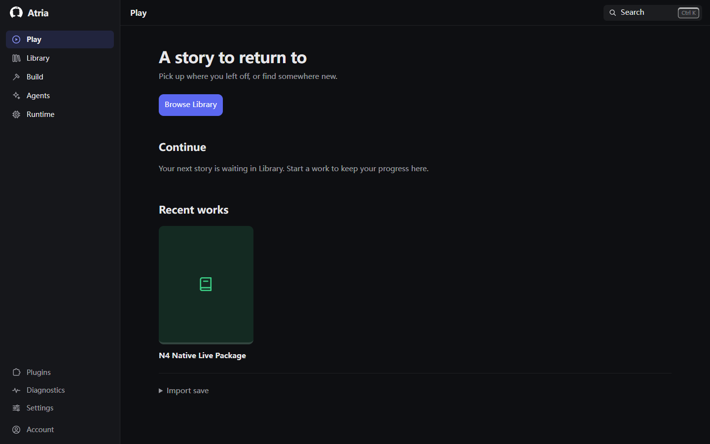
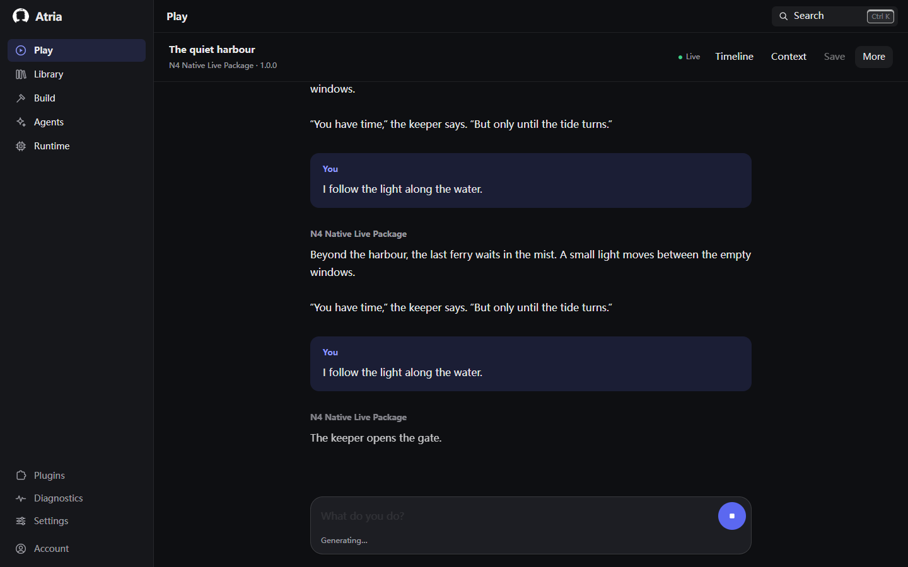
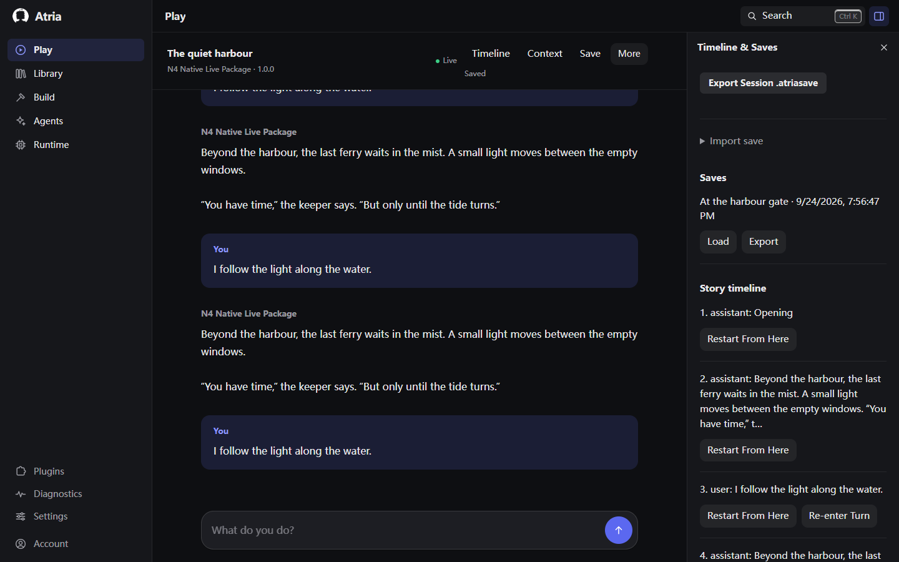
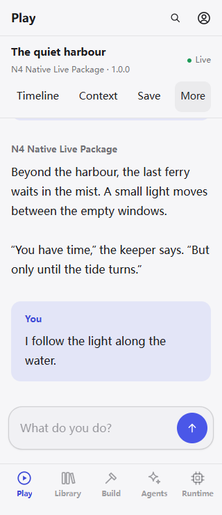
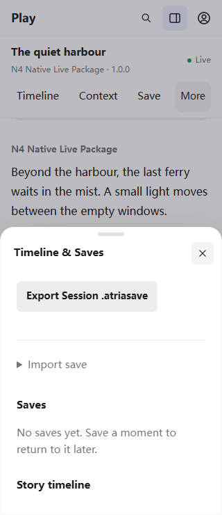
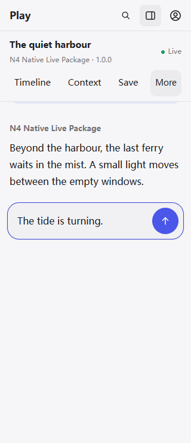
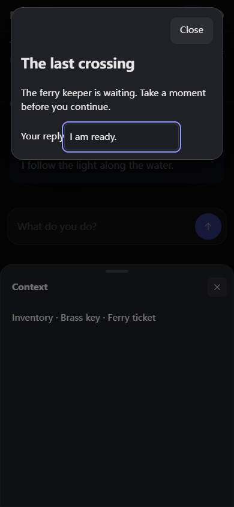
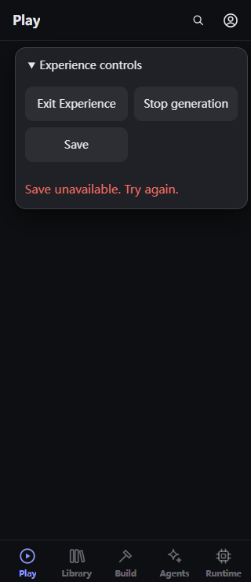
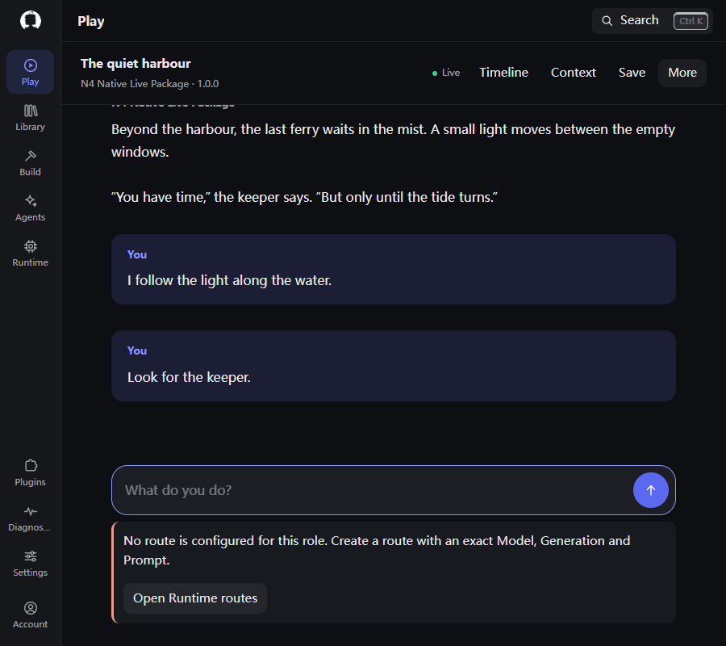
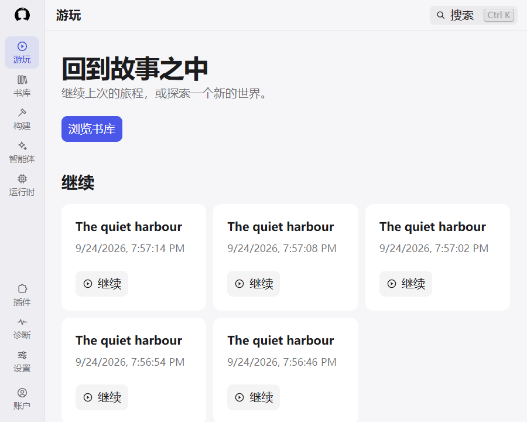
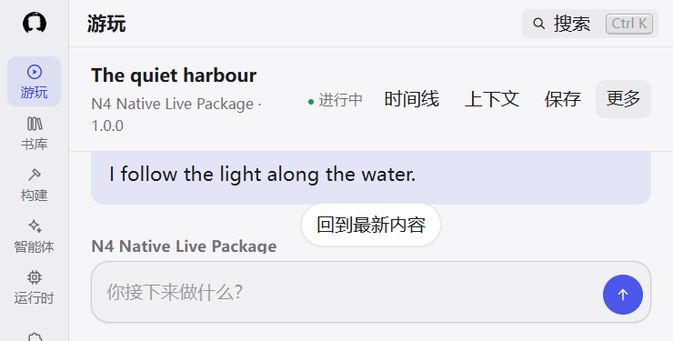
