# Frontend redesign — Phase 4 Library

- Date: 2026-09-24
- Repository: `ZZZdragondYNGPHX/Atria`
- Branch: `refactor/atria-product-frontend-redesign`
- Main verified after fetch: `402b53a98a823573591db4e9fd015f98e6effbdb`
- Starting branch HEAD: `27a61893a285365c4c42e7ac21bd4263227afc5b` (Phase 3)
- Implementation HEAD: `1ee087510c39926616ccc8cfad22cb435e63de36`
- State: implemented, validated, committed and pushed; **not merged into main**.
- Completed: Phases 1–4. Outstanding: Phases 5–8. Stop until Phase 5 authorization.

## Delivered

Works uses stable-id generated covers and a searchable poster grid. Installation
and portable-save import have explicit file review, permission grants, pending
feedback and local errors; failed installation preserves the file and grants.
Work detail has a hero, Continue/Start New, installed versions, exact dependencies,
permissions, progress rows and disclosed management actions. Referenced work
deletion remains blocked by the existing service; native confirmations return
focus. Export/import and progress actions reuse nativeProductClient.

Worlds and Knowledge use grouped lists, named create/rename controls, literal user
names, readable Knowledge prose, binding references and a revision timeline with
exact payload disclosure. Loading, retry and filtered-empty states are distinct.
Late fetches cannot replace a newer detail route or an unmounted workspace.

Prompt Programs, Modules and Generation Profiles use origin-filtered technical
lists and a structured Library editor. Package originals are read-only; Fork and
Derive still copy the exact dependency closure. Simple/Advanced preserves the
full draft; saves produce immutable revisions and keep existing refs pinned.
Library save copy is distinct from Studio Review/Apply. Stage edits restore focus.
The shared Studio editor retains its default review path and no backend changes.

Skills keeps its existing scope, import, file controller and expectedSha256
contract. Native buttons replace clickable divs/spans; tabs support arrows and
Home/End. Import/secondary row actions are disclosures, with inline load retry,
request deduplication and focus restoration. The file editor has labelled fields,
a named heading and persistent save/conflict feedback while retaining unsaved
text. The bundled endpoint installs the entire collection and can replace local
copies: the misleading per-row “Install this” control is removed, and the bulk
control explains its actual scope. No new installation endpoint was introduced.

Medium and compact Library share an accessible section picker through the same
WorkspaceHost routes; desktop retains the section strip. Compact rows stack,
posters form two columns, and long exact identifiers wrap inside disclosures.
The compact picker gives its selected section the full width. Dark/light tokens,
safe-area padding and Chinese copy follow the completed foundations.

## Preserved boundaries and scope

No router, configuration store, persistence path or runtime authority was added.
Native Session/generation ABI, Game Stage/transient/recovery, Studio exact
revision/ChangeSet/human review, Library identities and plugin resources remain
owned by their existing services. Backend code is unchanged.

SillyTavern migration remains retired. Atria backup/restore, storage-engine
migration and upstream Native ABI remain. Runtime, Build/Studio, Agents and
utilities are not redesigned in this phase. Adjacent edits only remove conflicting
Skills presentation rules and update the shared prompt editor's Library mode.

## Executed validation

- Jest: **48 suites / 558 tests passed** across `atria-shell`, `skills-ui`, `skills`.
- Final focused polish regression: **35 suites / 337 tests passed** in Shell and
  Skills UI; includes request deduplication, focus recovery, stale response
  isolation, literal authored text, exact refs, read-only originals and file hashes.
- Full `npm run lint` passed; targeted ESLint covers all changed JS/tests.
- `node scripts/check-p8-model-prompt-integration.mjs` passed: P0–P7, A0–A9,
  N9/N10, exact reads, no dual write and no hidden Native fallback.
- Last targeted review regression: **4 suites / 32 tests passed**; targeted lint passed.
- Two cold frontend cache builds passed using isolated scratch data roots.
- Browser regression: **12 existing acceptance cases passed** across
  `06-library-runtime`, Native Product `02-product-ui`, and `07-play-redesign`.
  Stale pre-N9 presentation expectations were replaced by current Native routes;
  ABI identity, single host, compact navigation and browser history checks remain.
- Phase 4 browser acceptance: **8 passed** in `08-library-redesign.e2e.js`
  (real package install, permission/retry, Work start/resume/delete protection,
  World/Knowledge, immutable edit/save, package Fork, Program/Profile, Skills hash
  conflict, keyboard tabs, bundled load retry and responsive/localized pages).
- Additional actual Playwright page: 320px light Library World form with simulated
  420px visual viewport; focused input remains in bounds and no horizontal overflow.

Tests run in Microsoft Edge via Playwright, using isolated seeded FsEngine data.
Ordinary failed first runs were corrected: disabled-trigger focus restoration;
outdated DOM assertions; missing Library fixture data; real immutable Native IDs;
and locators that kept filtering by a heading after a successful row replacement.
No CI result is used as local acceptance evidence.

## Review and corrections

frontend-design led presentation within DESIGN.md; ui-ux-pro-max informed form
validation, dense resources and responsive flow. web-design-guidelines reviewed
implementation against the current upstream command.md (fetched 2026-09-24).
emil-design-eng supplied final interaction review.

| Before | After | Why |
| --- | --- | --- |
| Generic RuntimeCards and exposed JSON for Library | Posters, hero, grouped rows, prose and optional exact Details | Content hierarchy follows the approved Library direction |
| Six sections clipped at medium width | Same-host section picker on medium/compact | Every destination remains reachable without a compressed tab strip |
| 180px mobile filter flex basis caused tall gaps | Compact filter uses content height | Avoid inherited desktop geometry on mobile |
| Confirmation opened from a disabled action lost focus | Restore the trigger after cancellation; focus local errors on failure | Keyboard users keep their place |
| Skill actions were div/span clicks | Native buttons, roving tabs and visible focus | Keyboard and touch use the same action handlers |
| Hash conflict appeared only in a toast | Persistent inline error, preserved draft and single pending write | Error recovery stays attached to the edit |
| “Install this” installed all bundled skills | Explicit whole-collection action and replacement notice | The control accurately describes the existing authority |
| Prompt save error was a raw code | Recovery guidance, preserved fields and exact error detail | Users can correct and retry without losing work |
| Old Skills nested panels and forced legacy colors | Flat file tree/editor headers using Atria tokens | Consistent Library/dialog presentation |

## Limits and next phase

No physical Android/Termux device, physical IME, live model credentials, Docker,
Android build or SQL backend matrix was used. Keyboard/safe areas are simulated;
actual rendered Chromium/Edge pages were inspected at desktop, medium and 320px,
dark/light, Chinese and larger text. Package fixtures validate exact core resources,
not every third-party resource provider. Scope-specific imports retain existing
controllers and unit coverage; no external URL import service was contacted.

Next only after user continuation: **Phase 5 — Runtime** (Routes, Models,
Connections, Profiles and Diagnostics), preserving model/connection/route/
generation/prompt/Secret authority. Keep the existing work branch and do not redo
Phases 1–4, merge into main, or begin Phase 6–8 at this checkpoint.

## Visual evidence

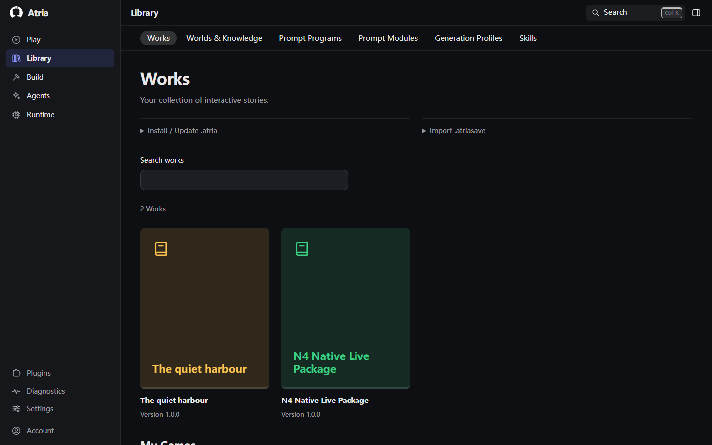

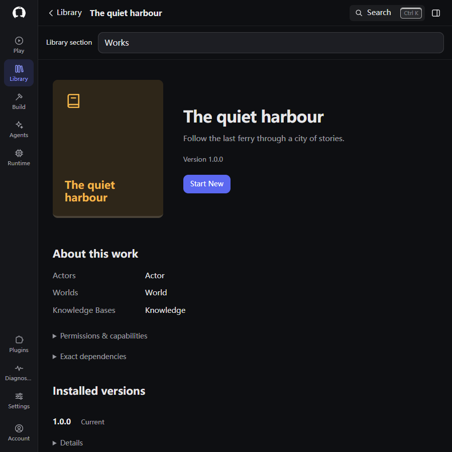

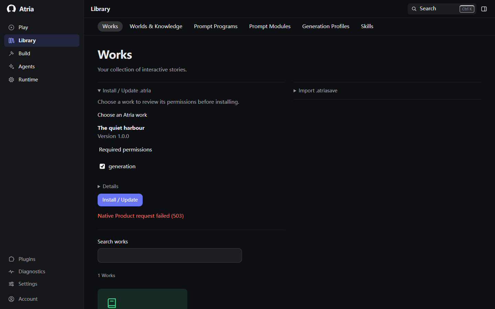

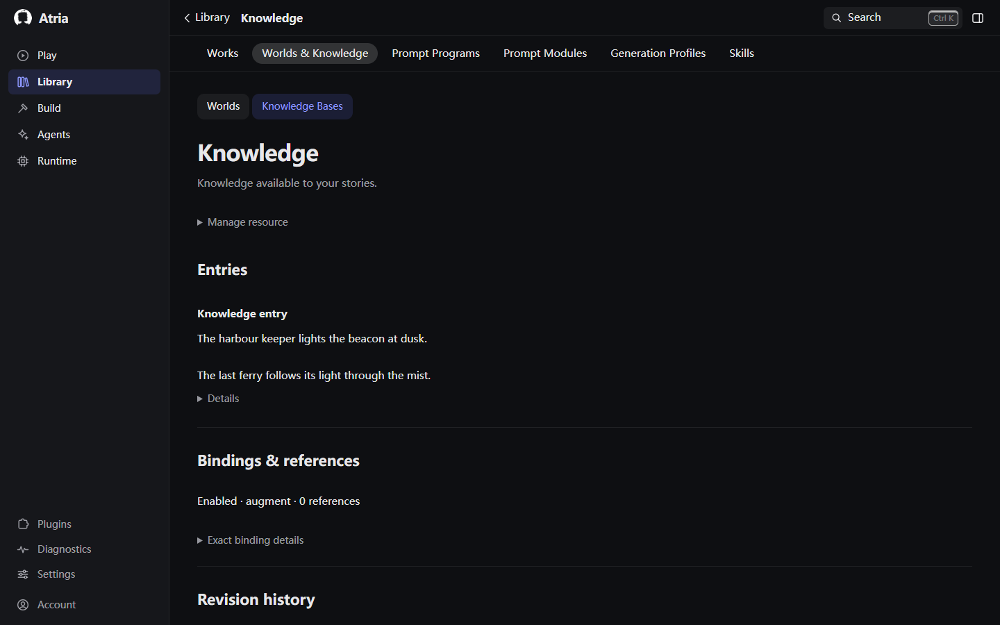

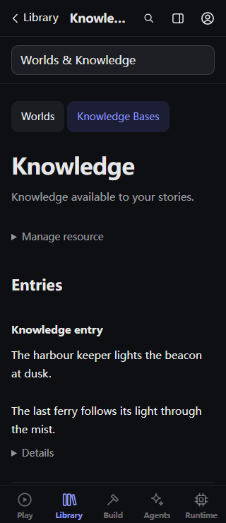

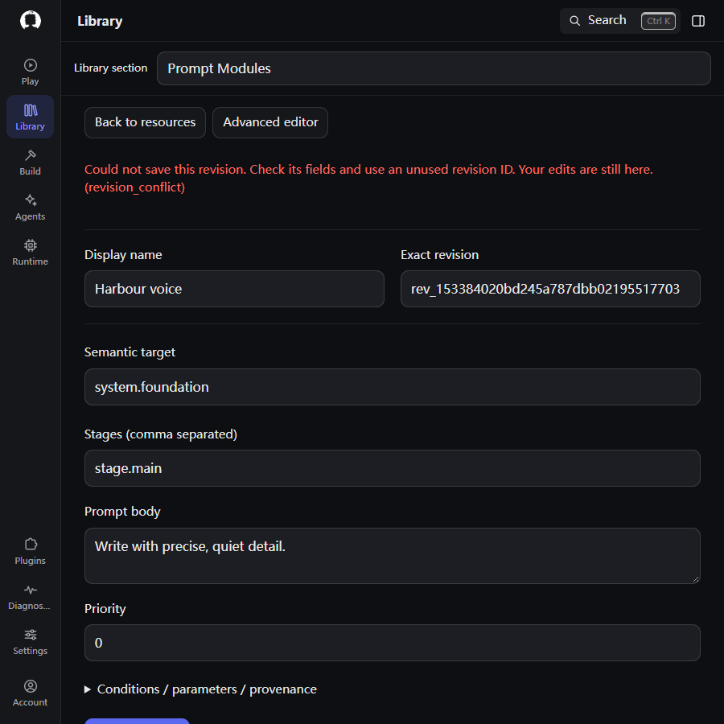

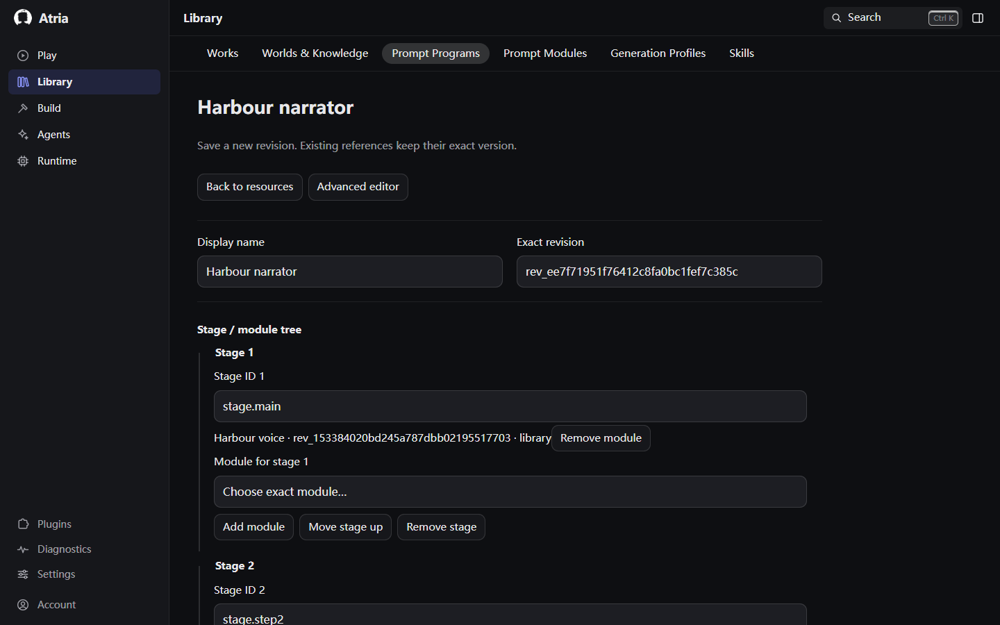

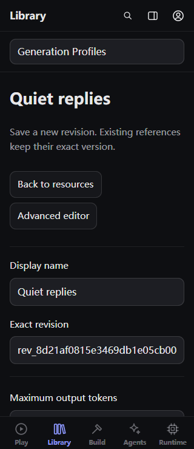

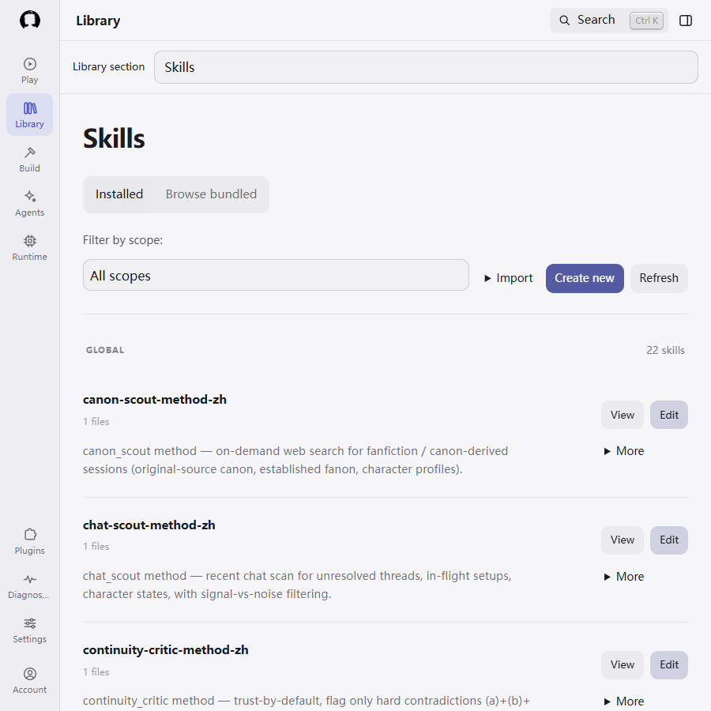

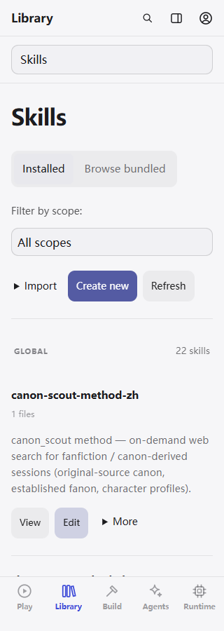

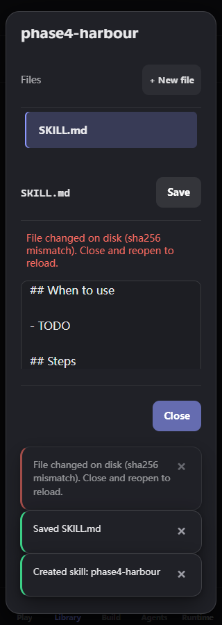

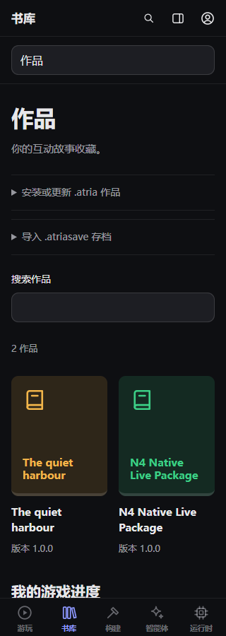

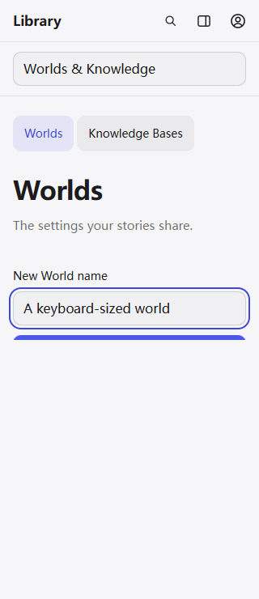

