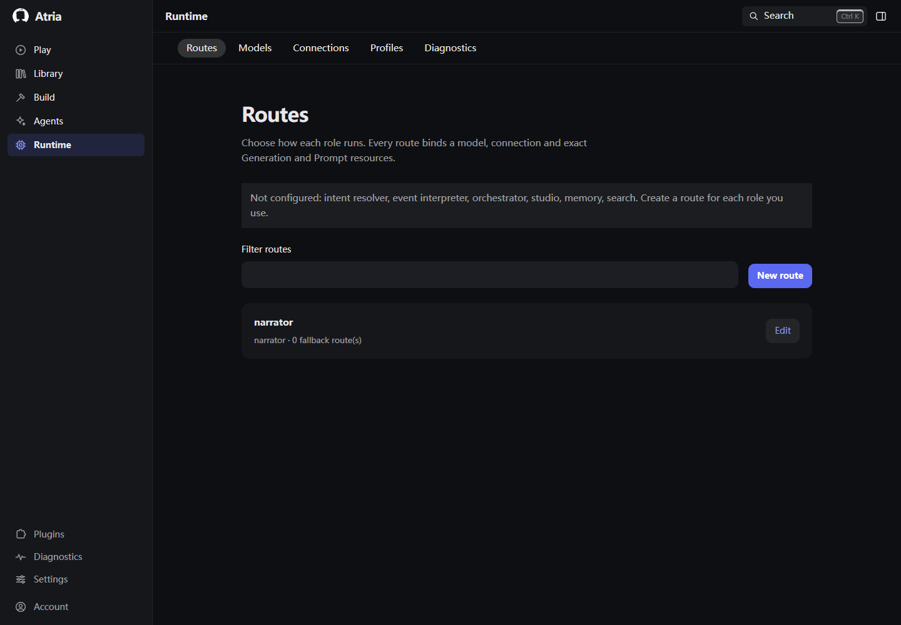
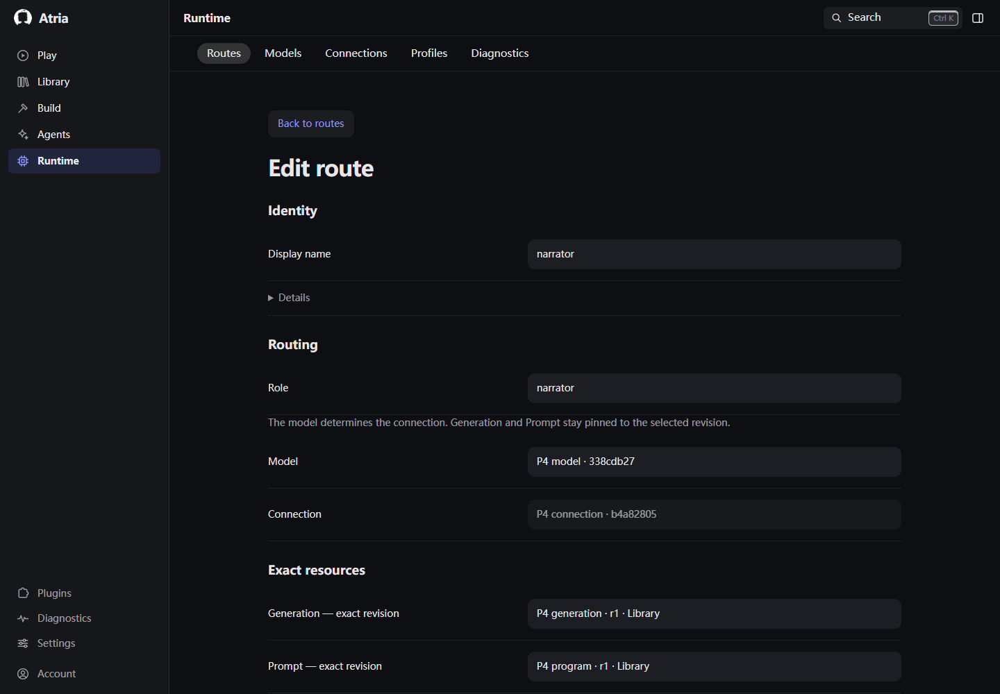
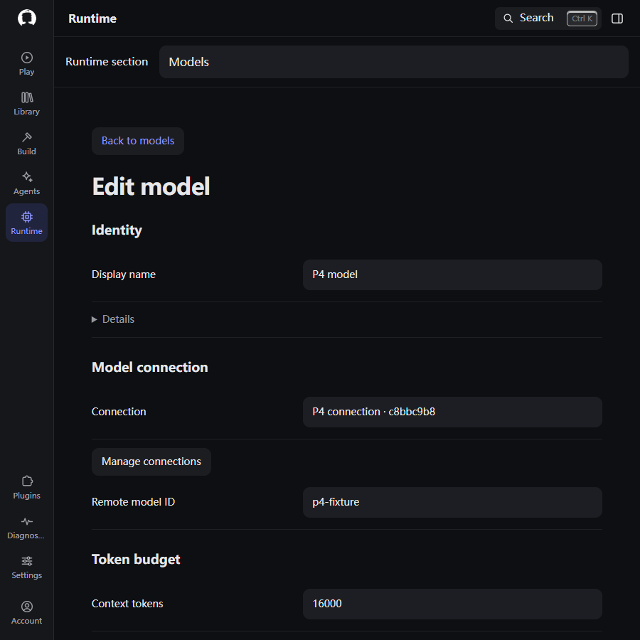
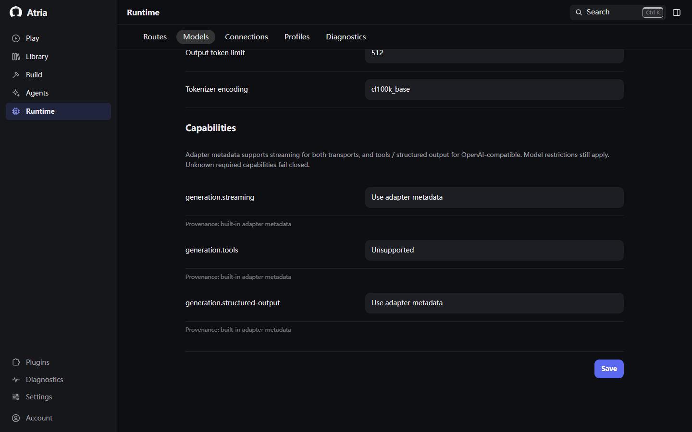
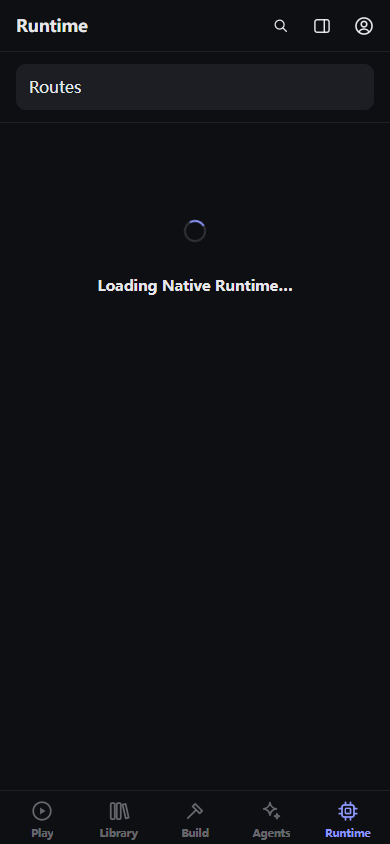
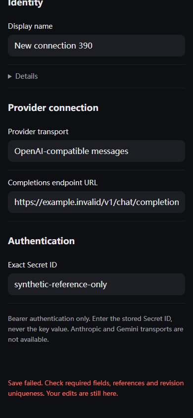
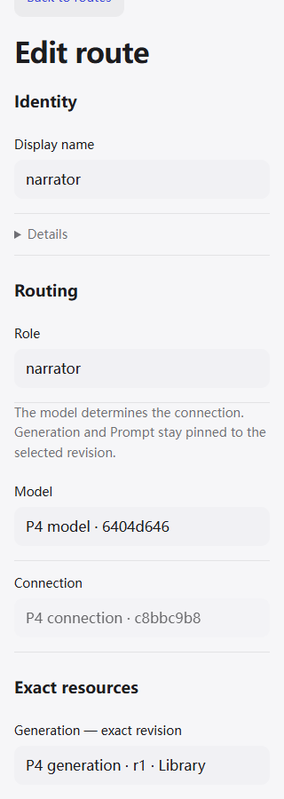
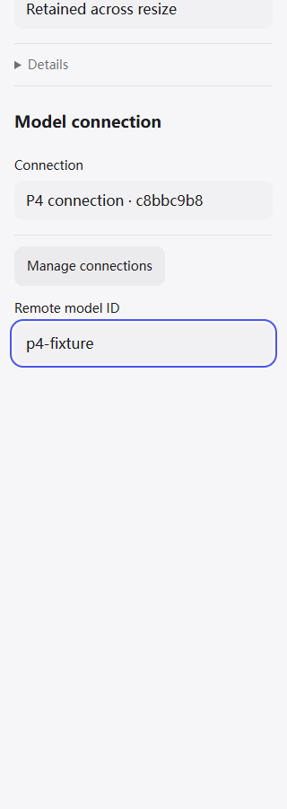
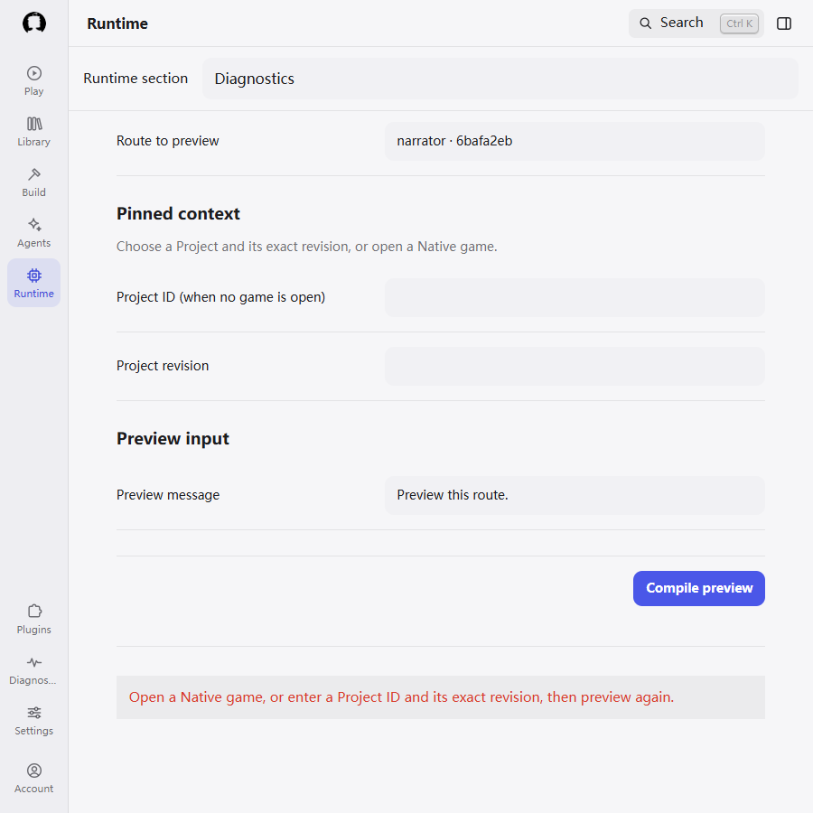
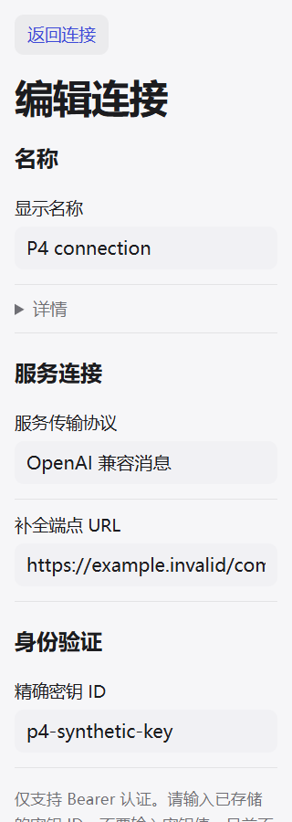

# Frontend redesign — Phase 5 Runtime

- Date: 2026-09-24
- Branch: `refactor/atria-product-frontend-redesign`
- Main verified twice after fetch: `402b53a98a823573591db4e9fd015f98e6effbdb`
- Starting HEAD: `1ee087510c39926616ccc8cfad22cb435e63de36` (Phase 4)
- Implementation HEAD: `853c590bff9169a5e29804bd9fe565a4371b51a4`
- Main implementation: `1ec5c0fe6b9c01b495db98a44e184e6ead7fede5`; final HEAD includes diagnostics polish.
- Status: implemented, validated, committed and pushed. Not merged into main.
- Phases 1–5 complete; Phases 6–8 outstanding. Stop pending user continuation.

## Delivered

Runtime Routes, Models, Connections, Profiles and Diagnostics now use the approved
system-settings direction: grouped semantic forms, aligned desktop label/value
rows, full-width compact fields, resource lists and on-demand stable-ID details.
The existing Native configuration client and serializers retain ownership.
Runtime presentation moved from Shell CSS into `atria-runtime.css`; shared request
feedback remains available to Play. Medium/compact section selection uses the
existing WorkspaceHost destinations through a labelled native picker.

Connections separates transport/endpoint from the exact Secret reference. Models
separates connection, token budget and capabilities/provenance. Routes separates
role/model binding, exact resources, fallback order and request policy. The stale
claim that visual Prompt authoring is unavailable is replaced with the existing
Library Prompt Programs destination. Profiles identifies immutable revision writes,
groups sampling/output controls, and validates stop-sequence JSON without losing
input. Diagnostics groups route/context/input, explains active Session ownership,
hides and disables irrelevant Project inputs, focuses results/errors and retains disclosed
request evidence. Preview never sends generation or changes Session state.

Compact editors use the existing Environment authority (719px boundary and measured
visual viewport), adapt when resized, retain fields, trap Tab, consume Escape,
restore Shell inert state and return focus. Errors receive focus; pending writes
are deduplicated and announced; successful writes followed by failed refresh keep
committed-state feedback. Late loads cannot replace newer views. Same-section
navigation out of a deep-linked editor restores its list. Shared loading/empty
primitives, dark/light tokens and simplified/traditional Chinese complete the flow.

## Boundaries

No backend, router, configuration store, Secret store or runtime authority changed.
Exact Library/Package/Project refs, immutable Generation revisions, capability
provenance, fallback validation/order, Native Session ABI and Studio review remain.
User names/remote identifiers/resource options are literal data, not translation
keys. No migration support is restored; legacy migration remains retired.
No Phase 6–8 content was implemented.

During implementation external edits appeared in root `AGENTS.md` and
`FORK_MAINTENANCE.md`. They were read, preserved and excluded from this commit.
The new root rules reference `public/AGENTS.md`, which was not present when checked.
Do not overwrite those external local edits during the next phase.

## Validation actually executed

- Initial targeted Jest: 2 suites / 6 tests passed.
- Shell regression after final functional edits: **25 suites / 104 tests passed**.
- Runtime/frontend/backend contract coverage: **6 suites / 61 tests passed**
  (`native-runtime-p5`, model-prompt contracts/persistence/P4/P6 and runtime HTTP).
- Final deep-link regression addition: **1 suite / 6 tests passed**.
  Counts above describe separate runs and overlap; do not sum them as unique tests.
- Full root lint passed; final changed frontend/test lint passed. The modified
  `.mjs` guard passed ESLint with its Node/module parser context.
- P8 aggregate architecture/residual guard passed after final implementation:
  P0–P7, A0–A9 and N9/N10; exact reads/no dual write/no hidden Native fallback.
- Three cold frontend cache builds passed using isolated scratch data roots.
- Final real Microsoft Edge/Playwright regression: **13 / 13 passed** across
  `06-library-runtime`, `04-native-runtime-p5`, `09-runtime-redesign`.
- After the final diagnostics screenshot corrections, **10 / 10 Runtime cases passed again**
  (`04-native-runtime-p5` and `09-runtime-redesign`); final targeted lint,
  architecture guards and a third cold build also passed.
- These cover native save/error/retry and immutable revisions, compile without
  Session mutation, exact identity, capability provenance, fallback role rejection,
  draft preservation, route/Library history, 719px resize, Tab/Escape, simulated
  420px keyboard/safe areas, Chinese 20px text and 320px horizontal overflow.
- Actual screenshot review: 1440 desktop, 900 medium, 390 and 320 compact; dark/light,
  forms, list, loading/empty/error, exact refs, preview and keyboard focus. Captured
  again after correcting the medium caption and keyboard focus-ring spacing.
- `git diff --check` passed.

The first new browser run failed due to an ambiguous test locator matching both
“Runtime section” and “Runtime sections”; exact matching fixed the test. Existing
P5 guard pinned CSS location/selector; it now checks the extracted stylesheet,
compact full-screen behavior, loaded CSS and shared Environment. Architecture
assertions were retained. Old regression fixtures log unavailable local optional
Stable Diffusion services; the new test disables that extension and no live model
service was used. No CI results were used as acceptance evidence.

## Review and polish

Formal DESIGN remains authoritative. frontend-design guided hierarchy;
ui-ux-pro-max informed focused errors and responsive forms. web-design-guidelines
was fetched from its upstream command.md and used for implementation review.
emil-design-eng supplied final interaction polish.

| Before | After | Why |
| --- | --- | --- |
| Flat, continuous Runtime form | Semantic groups with aligned fields and disclosed IDs | Separate configuration decisions without nested cards |
| Old 700px modal and fixed viewport height | Environment-driven 719px mode, measured viewport and resize adaptation | Preserve focus/draft across compact and keyboard transitions |
| Hidden focus after a failed save | Focusable inline feedback and retained draft | Keyboard recovery stays attached to the edit |
| No visible pending-save message | Saving status, aria-busy and a single pending write | Prevent duplicate revision writes and explain progress |
| Inline CSS island in Shell | Runtime stylesheet using existing tokens | Keep the owning domain coherent |
| Mid-width picker caption wrapped | Nonshrinking caption and full-width compact selection | Stable navigation hierarchy |
| Keyboard focus ring clipped at viewport edge | Scroll margin on interactive controls | Keep the whole focus indicator visible |
| Compiled evidence touched the submit button; active Session left irrelevant fields visible | Separate result section and conditional Project fields | Make preview ownership and outcome easy to read |
| Technical transport copy untranslated | Chinese forms and protocol/help text | Coherent localized configuration experience |

## Limits and next phase

Physical Android/Termux/IME, external model credentials/services, Docker/Android
builds, SQL backend matrix and the full repository test suite were not run.
Keyboard and safe areas were simulated in an actual browser. Existing unsupported
transports and Generation controls remain explicitly unsupported; this phase does
not introduce new runtime capability. No known unfinished Phase 5 item remains.

After user continuation, execute **Phase 6 — Build / Studio** on the same branch:
complete authoring workspace, review/ChangeSet/conflict, preview and Project Agent,
preserving inspect/review/execute, exact revisions and human authority. Fetch and
read latest handoff first; do not reset unmerged Phases 2–5 to main or redo them.

## Selected screenshots

