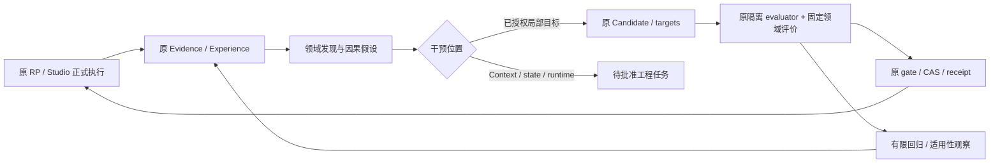

# Atria M1：RP / Project 自迭代领域能力扩展研究

- Task ID：`agent-intelligence-runtime`；研究日期：2026-10-09。
- 状态：**研究与设计差距分析完成，待讨论；不是批准后的实施 Plan。** 不修改产品、不扩大自动授权、不改变 M1 门槛、不进入 S11 / G。
- 核对产品：`feat/agent-intelligence-runtime@a61b249ef71f108d279ec7bd883fb5eeae97a463`；main：`ed1fd90521a63363e29856601abbf5e908c99d10`，未合并；起始 docs：`6f1c18056`。
- 权威入口：[index](agent-intelligence-runtime/index.md) → [M1](agent-intelligence-runtime/m1-evolution.md) / [S10](agent-intelligence-runtime/s10-evolution.md) / [acceptance §9](agent-intelligence-runtime/m1-acceptance.md#9-2026-10-09-来源读取修复的有限周期)。来源生命周期依 [S05](agent-intelligence-runtime/s05-feedback.md)；后续能力边界依 [delivery](agent-intelligence-runtime/delivery.md) 与 [execution-reuse](agent-intelligence-runtime/execution-reuse.md)。永久历史：[同一 Record](../../records/refactor/agent-intelligence-runtime.md)。
- 本轮只有公开资料调研与相关代码/文档审计，零测试模型请求。原累计 `761 requests / 2939582` 记账 tokens、17 unknown / 74948 上界、所有 quota/rate/失败窗口保持；五个无关 dirty 文件保护；不读写 `reference/*`。

## 1. 结论与证据分级

M1 已有可复用的**有界改进控制闭环**，尚未形成覆盖完整领域质量的持续发现机制。主要差距是质量定义、真实反馈供给、因果归因、长程测量、候选比较和跨任务适用性；缺口不只是“案例数量不够”。

应保持 `正式执行 → 原 Evidence / Experience → 诊断 → 原候选 → 原 evaluator → 原 target / CAS → 下一 run → 监测 / 撤回`，在此链路增加有版本的领域评价与诊断适配。优化方法可以多样，写权限必须仍由原 authority 决定。候选生成器不能改变质量标准、事实、角色身份、权限或发布条件。

两种演化必须分开：**系统策略学习**改变可复用的做事方式；**故事中角色成长**改变有因果依据的角色状态。用户偏好、World fact、角色认知、评委意见和诊断假设也不可互相替代。角色学会信任某人不是给 Skill 追加永久“相信某人”；系统学会尊重角色知识边界不等于写入角色已经获知秘密。

本文用以下标记约束结论：

| 标记 | 意义 | 能支持的结论 |
| --- | --- | --- |
| C | 当前源码/权威 Plan 的直接事实 | 契约与实现路径；未运行的新测试不称通过 |
| A | Atria 已保存实测 | 对该 source、case、配置与有限范围成立 |
| E | 外部论文中的实证；注明发表/预印本状态 | 支持方法在原研究设置有效；不等于 Atria 效果 |
| R | 作者实现/社区项目报告 | 可借鉴设计；未独立复现，不视为普遍定律 |
| H | 本文架构建议或迁移假设 | 待讨论、冻结与验证；没有实施授权 |

当前 A 证据：a61 双入口各三个 development pair，12 arms 原检查通过；RP 双模型一致胜 1/3、两项分歧、continuity 有 -1；Project 三项一致 tie。M1 未达标。合成 v1 已指导修改，不能再作为未见验收；未执行 v2。几项得分不构成领域质量的完整定义。

## 2. 重点研究来源与适用边界

所有来源于 2026-10-09 阅读。论文固定所列版本；DSPy overview 的最后修改commit为 `638e155cf725236fe5d01b5332394a7bc128881d`，RP-Bench README为 `393c4ab0e2e3f27f97b051a12a348ff7b6dcda6b`（公开GitHub按文件查询），对应正文使用下列固定链接。其它作者仓库为访问日可变文档，正式采纳还须锁定完整代码/数据revision。只阅读资料，未安装 DSPy、运行外部 benchmark 或复制其框架。以下来源摘要限制在必要方法与边界，其余设计为 H。

| ID / 来源 | 核实的方法与证据 | 可迁移部分 | 边界与不能推出的结论 |
| --- | --- | --- | --- |
| S1：[GEPA，arXiv v2](https://arxiv.org/abs/2507.19457v2)；[作者 DSPy 文档](https://github.com/stanfordnlp/dspy/blob/638e155cf725236fe5d01b5332394a7bc128881d/docs/docs/api/optimizers/GEPA/overview.md) | E/R：利用执行轨迹、文本反馈进行反思式候选变异，保留各样本表现互补的候选，并可合并组件。作者在六项任务报告收益及 rollout 效率。 | 反思应接到实际步骤、输出和失败；用有限候选档案保留互补能力。 | 原论文成绩不证明 RP 文学/长期偏好收益。默认 per-instance frontier 不是完整多目标 Pareto 证明；当前 DSPy objective tracking 影响父代/merge，最终仍由 scalar score 决定，`objective_pareto_front` 是各目标独立最大值，不能冒称某个版本同时达到这些最大值。搜索 valset 不是独立验收集。 |
| S2：[RP-Bench 作者 README](https://github.com/LeviTheWeasel/rp-benchmark/blob/393c4ab0e2e3f27f97b051a12a348ff7b6dcda6b/README.md) | R：访问日 README 提供 27 维 rubric、多轮 session、带证据的缺陷检测及人类校准入口。报告的来源含真实聊天纠正和 swipe 派生信号。 | 提示文学、交互、角色与题材维度应分开；整段会话与单轮表达分别评价。 | 本文按这个具体社区项目解析 RP-Bench，不将其视为已核实同行评审结论。权重/禁用文风/题材偏好不直接移植；原始聊天不公开，本文未审计。README 也报告宽泛缺陷类掩盖目标失败的问题，故缺陷标签不能只靠统一“文风差”。 |
| S3：[PHASE-Tree v1](https://arxiv.org/html/2608.06975v1) | E（预印本）：身份根与 persona/session/moment 分层，按证据、阻力、冷却更新；评测当前演化状态下的下一句。主要验证路径为显式状态供给，LoRA 为另一路径。论文有盲评人类研究。 | 区分稳定身份、慢变化性格、局部情绪；评价状态适用性与未改字段保留。 | 长对白语料/next-utterance 不是开放世界在线成长证明；研究阈值不照搬。不得把该树引入为第二 Actor/World authority。LoRA、跨 episode 自动人格写入都超出 M1。 |
| S4：[NCP-Bench v1](https://arxiv.org/html/2608.08160v1)；[作者仓库](https://github.com/NLP2CT/NCP-Bench) | E/R：显式 facts、commitments、trajectory；独立 auditor 检查事实、承诺和玩家输入冲突，多轮测一致性。记忆增强方法在研究中存在承诺保持与玩家输入保真之间的取舍。 | 区分事实成立、承诺兑现、输入响应和叙事进展；逐回合留下冲突证据。 | 电影梗概、顺序参考轨迹、模拟玩家；论文明确暂未处理分支时间线/倒叙等。照搬必达剧情会损害自由 RP，承诺不是允许强制玩家走剧情的权限；一致性也不是好文学的充分条件。 |
| S5：[Narrative State Tracking Agent / NstAgent v1](https://arxiv.org/html/2609.35759v1) | E（近期预印本）：无训练地维护角色、已发生事件、未兑现要求，用有界读写工具逐章生成；研究覆盖 10K–100K words。 | 将回顾事实与未来义务区分，并以来源与状态更新证据验证。 | 英文实验、无人工评价；短篇强模型可能与摘要接近。论文说明错误抽取可能自我强化，源章节核验尚非系统组成。小说作者可改旧章节的权限不能移植到玩家正式历史；不能据此称 RP 体验或 Atria 状态正确。 |
| S6：[Towards A “Novel” Benchmark，ACL Findings 2025](https://aclanthology.org/2025.findings-acl.1114/) | E（同行评审）：宏观结构/创意/共鸣，中观情节/人物/环境，微观语言及整体质量；中英作品、人类评价及题材例外。自动评价与人工只达有限相关。 | 以不同时间尺度评价文学，题材条件显式化；避免一轮漂亮句子覆盖长程退化。 | 原研究的 3K–20K words/中文字符级作品不是完整小说长度，也不是交互式 RP。作品评判不能奖励越过玩家权威的“完整结局”；不用该论文得分代替用户个人喜好。 |
| S7：[MT-Bench / Chatbot Arena，v4](https://arxiv.org/abs/2306.05685v4)；[Self-Preference Bias，v2](https://arxiv.org/abs/2410.21819v2) | E：位置、长度、自偏好等偏差；后者发表于 NeurIPS 2024 Safe Generative AI workshop，显示熟悉文本偏好值得单独测量。 | 配对盲评、顺序反转测试、长度控制、人类偏好分层校准。 | 两个模型 identifier 不证明独立厂商/独立偏差；旧基准 agreement 不外推当前网关或中文 RP。相互同意也可能共同错误。 |
| S8：[Rubric Artifacts，v1](https://arxiv.org/abs/2609.02942v1) | E（预印本页面注明 EMNLP 2026 接收）：仅 rubric 文本就能预测部分 judge 输出，反转回答/标准时判断未必相应变化。 | 校验评委是否对真实内容与反例敏感，而不是只输出格式正确的分数。 | 不能推出所有 LLM judge 无效；需要本领域校准。本文未复现实验。 |
| S9：[τ-bench 原论文](https://arxiv.org/abs/2406.12045)；[Anthropic agent eval 实践](https://www.anthropic.com/engineering/demystifying-evals-for-ai-agents) | E/R：正式最终状态、任务过程与重复一致性分开；能力提升套件和回归套件职责不同，饱和/歧义需检查。 | Project 验证实际 source/Review/receipt，RP 同时检查轨迹与正文。 | 模拟用户不是真人；软件任务的可验证成功不能完全定义审美质量。此处只采用方法，不引入外部运行平台。 |

## 3. 当前 M1 的通用能力差距矩阵

“计划”区分 M1 原承诺与后续路线；不把后续路线当已批准实施。源码以附录 C1–C7 为依据。

| 能力 | 已实现 / 实证 | 权威设计意图 | 缺口与影响 |
| --- | --- | --- | --- |
| 双域来源、结果与恢复 | C：RP exact variant / trace；Project task / validation / Review / Git receipt；缺失显式化 | M1 跨运行可信证据 | RP 捕获覆盖有限，memory case 是 fixture 注入；正文流畅不能证明生产记忆/状态正确 |
| 反馈与诊断 | C：explicit/observation/technical、source 重验、CAS/withdraw/delete/retention、model_hypothesis | S05 分层、事件/批次触发、不把弱信号当偏好 | dimension 只有 behavior/style/correctness/workflow/general；direction 只有 skill/prompt/orchestration/undetermined；复杂领域问题不可结构化归因 |
| 自动反馈供给 | C：Experience API 的 submit/outcome/diagnose 可唤醒原 Evolution | M1 正式运行→结果/反馈→下一轮 | 定向检索未找到普通运行终止直接提交 outcome 的调用；UI 显式反馈和私有 fixture 不等于持续供给。需要独立验证端到端采集与去重 |
| 新问题发现 | C：显式/技术失败事件，三个不同弱来源可触发反思 | M1 有证据聚合，弱观测不定方向 | 无已交付的领域覆盖、饱和/漂移检测、质量缺陷聚类与发现证据报告；成功但乏味的输出也可能无信号 |
| 候选与执行目标 | C：两域 Skill/Prompt/有限参数六种局部 target，原 version/CAS/binding；文本 1–4 局部 edits | 单目标、至多两个候选、一次 publication；不改源码/权限/全局/连接 | 当前每 job 实际提炼一个；无有界互补候选档案/目标冲突管理；不得为了通用优化放宽 writer |
| 隔离 evaluator | C：固定 worker、私有副本、parent provider/secret、checks/usage/pins | 独立场景、paired trials、失败拒绝 | 固定 families/catalog 与严格 exact schema；未交付任意 domain module、case lineage、长程 replay 与新的 rubric version 迁移 |
| 质量范围 | C/A：RP agency/memory/variant；Project rename/conflict/repair | M1 表述含文风、authoring 质量与适用性 | 三 family 各一场景不是质量定义。RP 输入同构，Project 简单目标饱和；缺改善空间和真实使用分布 |
| 验收与晋升 | C：原 human/price/budget gate；test-only 双模型工程验收 | 三场景×三次、九对/至少六胜、非回归与原闭环 | 固定次数是最低证据要求，不是统计泛化证明；新增领域维度不能悄悄用均分补偿旧底线 |
| 监测、恢复、撤回 | C：intent/receipt/recovery/guarded rollback；来源失效暂停 | 结果、有效 binding、下一 run 消费分开 | 长期领域漂移与用户偏好改变的自动监测没有完整实证；观察期不是无预算持续循环 |
| 成本 | C：durable reserve/settle、unknown 上界、owner/scheduler、quota/rate、失败窗口 | 有界后台计算；生产有限 owner/job | 测试 token advisory 与生产预算不同；未交付收益驱动多候选调度或可证明的 provider cache 节省 |
| 长期状态/经验复用 | C：诊断有期限和适用条件，局部隔离 | 后续 M2/M3 认知/成长；D4→G 有效性证明与复用 | 诊断 ledger 不是长期知识库、记忆事实图或跨 Project 全局策略；后续内容未实施 |

## 4. RP 领域差距与测量设计

以下领域定义是 H，研究支持来源为 S2–S8；未声称对应新案例已发生失败。指标应指定评价单位：一句/一轮、场景、episode、跨 episode。未观察到必要时间跨度时用 unavailable，不估算“长期质量”。

| 维度 | 当前覆盖 / 计划归属 | 需要的可观察质量证据与缺口 | 主要非 Prompt 依赖 |
| --- | --- | --- | --- |
| 文学表现 | M1 概念含 style；无完整文学 rubric | 场景化细节、语言节奏、意象功能、重复和陈词滥调；与角色视角一致。好/坏不以字数和华丽程度决定 | 表达模型能力、Creative 条件、语言/题材样本与评委校准 |
| 叙事结构 | 无宏观/中观实测 | 因果推进、伏笔与兑现、场景转换、张力/节奏；单轮质量与长程结构分别评分 | 原事件/时间/承诺与可用规划，不把未执行计划当历史 |
| 角色认知/防全知 | memory case 只测有限 exposure/知识边界 | 谁观察/听说/推测了什么；误解何时被纠正；作者知道≠角色知道 | 知识可见性、per-actor Context、证据与推测投影；后续 M3 |
| 人物性格 | 原角色/Skill 可消费；未测人格稳定 | 压力/诱惑下仍保持有区分的行为和语气；允许合理矛盾，不奖励僵化口癖 | 稳定身份与慢变化 state；作者设定/Package 不自动改写 |
| 角色成长 | 未交付 M1 成长状态；M3 路线 | 事件→评价→渐变→行为后果；未变化字段保留、跨场景回溯、撤销错误依据 | 原 Actor state 更新 authority、证据门槛/冷却与保存恢复 |
| 情感真实性 | 无专门覆盖 | 情绪与经历一致，有延迟、混合情绪和不完美应对；不以强烈情感词密度衡量 | 情绪/关系 state、appraisal；不能以取悦用户覆盖角色动机 |
| 世界连续性 | 部分 variant/记忆 checks | 时间、地点、物品、伤势、事件因果与分支适用性；既有事实允许经合法事件变化 | 原 World/event/branch authority；非第二事实账本 |
| 玩家自主权 | agency 与 owner checks，已有局部实测 | 不代写行动/想法/感受；合理回应已声明行动，保留选择后果 | output owner 与行动权限；正文判断不能替代工具 guard |
| NPC 自主性 | Director 执行可用；无完整质量覆盖 | NPC 有动机、拒绝/主动行动和代价；推动场景但不强迫玩家 | 有界 Goal/意图/行动 authority；后续 M2/M3，不做无限背景行动 |
| 对白质量 | 无专门 rubric | 角色声音区分、潜台词、接话、言外之意、对白/行动比例适配场景 | 当前关系/知识视角与局部语言模型能力 |
| 题材特性 | 固定场景不代表题材 | 悬疑的信息释放、喜剧时机、恐怖不确定性、浪漫关系节奏等条件化标准 | 题材/模式是获准配置；奇幻违反现实物理不自动判错 |
| 长期记忆 | fixture 直接供给 revision，未验证实际 resolver | 记忆选择、修订/撤回、应用时机、过期适用性、不机械复述；跨 run/重启 | 原 memory/source retrieval、压缩、Context exposure与失效路径 |
| 用户偏好 | explicit prefer/avoid 有来源；没有长期偏好模型 | 具体用户/角色/题材/时间的偏好适用性与改变；非所有用户统一审美 | 用户授权与保留期限；弱 swipe/edit 不等于偏好标签 |

Atria 已保存的具体 A 负例更适合明确问题：输入只给“约定午夜”，正文却推断当前 dusk/night/before midnight；玩家只是暂停，candidate 写了手搭门闩等身体细节。当前时间推断、氛围创作与行动代写要分开判定。时间/角色归属不明时不据文学偏好补事实。旧 continuity -1/+2 与偏好分歧保持，不能改解释取得资格。

PHASE-Tree 可提供状态时间尺度的设计启发，NCP 提供承诺检查，Novel 提供文学尺度；三者组合在 Atria 的有效性仍是 H。不能把原未来社会认知、状态演化和 memory resolver 静默塞进 M1。

## 5. Project 领域差距与测量设计

Project 目前是原 Studio authoring/Task authority 范围，不能直接等同可任意修改源码/部署的通用编码 Agent。架构/测试研究首先评价当前可操作产物及工具协议；代码、外部系统和扩大 writer 都需另行批准。

| 维度 | 已有覆盖 / 计划 | 新质量问题与证据 | 扩展边界 |
| --- | --- | --- | --- |
| 任务规划 | 原 plan/steps、六轮有限执行；仅简单 rename | 目标分解、依赖排序、假设核验、验收条件/完成状态一致；能调整错误计划 | 计划是提案，未做操作不能记 completed |
| 架构退化 | 原 schema/ownership/单 changeset | 关联设计是否增加循环、重复配置、耦合与不一致；多个任务后是否结构退化 | 正式 source/依赖图可确定性检查；不能仅依据评论多寡或目录数量打分 |
| 测试盲区 | 原 validation/repair 与相关工程测试 | 缺少边界、负例、交互条件；“validation passed”仍可能不满足用户目标 | 工具/schema通过与语义/使用结果分别评价；测试生成者不能单独判断充分性 |
| 回归风险 | source/base/CAS/Review；简单修复案例 | 无关字段/资源/调用方保留，旧用例与历史可恢复；跨任务组合回归 | 发布前测试真实消费者，独立合格候选不自动组合 |
| 执行成本 | 全 sends/usage 计账，paired tokens 单列 | 避免重复探索/无效 repair，报告延迟和成本/成功任务；必要 source 读取不可删 | token 节省不能替代质量、权限与正确性；未知费用保持 unknown |
| 可靠性 | durable task/receipt、取消/重启/recovery | 工具错误、部分成功、响应丢失、重复动作、冲突解释和恢复方案 | 原 receipt 证明效果；不因模型声称成功就重放/提交 |
| 权限 | owner/base/Review与受支持 target | 越界请求、跨 Project 污染、读写最小范围、read-only | 不让 optimizer 修改 allowlist/审核路径 |
| 安全 | worker/private FS、secret仅parent等边界 | 非可信 source/工具返回中的指令注入、敏感内容泄露、危险建议和依赖来源 | 应以明确威胁/攻击路径取样；不凭文风宣称安全，M1不新增外部writer |
| 长期知识积累 | Experience hypothesis/条件/失效/retention | 哪些 lesson 真能复用，何时过期，已解决经验如何避免过度泛化 | 诊断不成为 source truth；删除/撤回依赖传递到派生产物 |
| 跨任务经验复用 | scope隔离；D4/G 复用仅有正式设计 | 相似任务的候选经验、依赖有效性、规则迁移和负迁移 | 相似度仅推荐；跨scope选择/授权与新验证，不能偷偷全局启用 |
| 关联修改/修复/冲突 | 原三个 family、正式 Review/repair/CAS | 更真实的多资源依赖、根因定位、冲突后有依据的下一步；保持无关内容 | 目前原基线已满足简单目标；新增复杂任务需证明可在工具/轮数内完成 |

旧 A 事实：97a 候选为减少探索而省略必要 source 读取，authoring -4/review失败；a61 恢复读取后完成目标。它说明成本策略可能损伤正确性，不能证明该任务上存在进一步 Prompt 收益。新问题应由正式结果和具体质量证据发现，不通过故意削弱 baseline 制造空间。

## 6. 通用引擎与领域模块的职责

下面是 H 的逻辑接口划分，不新增资源 kind、平行服务或动态执行模型代码。

| 责任 | 通用引擎沿原系统承担 | RP / Project 领域模块承担 | 禁止越界 |
| --- | --- | --- | --- |
| 来源 | authenticated owner/scope、exact refs、source freshness、用途/保留期限 | 选择与解读已授权的输出/事件/Review/receipt | 不复制另一份有效事实；不把 judge 推断标为 Host outcome |
| 问题发现 | 批次去重、证据指纹、有限扫描、触发/成本 | 缺陷分类、覆盖空白、偏好条件、代表性样本 | 不固定每回合调用模型，不把所有缺点转换为自改授权 |
| 因果诊断 | diagnosis来源、条件/反例、支持状态、依赖与暂停 | 可观察触发、影响维度、候选原因和反事实检查建议 | hypothesis 不变 fact；多个原因可共存，unknown 可保留 |
| 候选搜索 | 原 targets、allowed field、base pin、有界候选/预算 | 建议 Skill/Prompt/已有参数修正或工程升级路径 | Context/state/runtime修复无M1 writer时必须转工程任务 |
| 评价 | 固定worker、原 compiler/provider、ledger、split隔离、report pins | domain/rubric/fixture、维度证据、N/A条件、任务可完成检查 | evaluator/rubric非可演化target；不让模型载入任意模块 |
| 筛选与发布 | 原重要底线、原晋升门槛、CAS/intent/receipt、next-run/rollback | 领域收益和回归报告 | Pareto候选仍未获发布权限；领域分数不能覆盖权限缺陷 |
| 观察/经验 | 原 Experience lifecycle、有效binding监测、取消/撤回 | 新运行上的适用性、偏好改变、故障分布 | 不在应用关闭时承诺持续运行；不建立无限 Goal |

建议借鉴 GEPA 的轨迹反思与互补候选保留，而不直接安装其 optimizer 作为发布 authority。候选档案只能包含原候选 refs、lineage、同一 development envelope 的成绩/缺失、适用条件和资源成本；不得保存另一份“有效 Prompt”。同一物理 target 的多个候选离线对比，一次只发布一个。M1 当前只生成一个、不实现搜索种群；任何增加到两候选的研究实验都需另行固定有限范围，不能利用原理论上限自动加请求。

真正的多目标比较应先排除硬底线失败，再在固定可比维度上判断 dominance；缺失维度不按零填充。某个候选每项≥另一候选且至少一项更好才可能支配，但样本误差/评分噪声仍需报告。用户偏好不同可保留互补候选，不强求一条全局“最佳”。最终仍经原九对/六一致胜等门槛，不以 frontier membership 或各目标最大值授予资格。

## 7. 质量依赖、优化冲突与回归评测

H：采用**不可补偿底线 + 条件化质量向量 + 有来源偏好**。原authority/隐私/玩家owner等底线保持布尔拒绝；文学/任务质量不压成一个总分；用户偏好只能在已满足底线的候选中表达取舍。某题材维度不适用须在执行前声明 N/A；缺失必需证据为 unknown 并拒绝，不能事后删除回归维度。

| 依赖/冲突 | 易被单维优化掩盖的回归 | 必须配套的交叉评测 |
| --- | --- | --- |
| 知识/时间正确 → 角色反应 → 连续性 → 叙事结构 | 越详细越易凭空全知/补当前时钟 | 未知当前时间但已知约定时间；同事实、不同角色可见视图 |
| 稳定性格 ↔ 有依据成长 | 永远不变得到一致性高分；无依据转性得到“成长”高分 | 同事件不同角色、无事件不变化、重大事件渐变、错误依据撤回 |
| NPC主动性 ↔ 玩家自主权 | NPC消极等待，或强迫玩家完成剧情 | NPC独立可行动、玩家拒绝/改道、保留行动后果和分支 |
| 叙事承诺 ↔ 开放选择 | 为兑现伏笔而抹掉玩家决定 | 作者允许的硬约束、角色承诺/失败承诺、可分支软目标分别测 |
| 情感真实性 ↔ 讨好/偏好 | 人物凡事赞同、快速亲密、情感过度升高 | 冲突、拒绝、慢热、混合情绪，分别记录人物一致与用户偏好 |
| 文学新鲜 ↔ 连续性/题材 | 创新引入未成立事实；反重复禁令抹掉必要意象 | 同风格不同事实、同事实不同风格；题材例外与功能性重复 |
| 记忆应用 ↔ 成本/隐私 | 机械复述所有记忆、召回他人秘密、压缩丢修订 | 有用/无关/撤回记忆混合；未授权秘密不可曝光 |
| Project少调用 ↔ 正确/可靠 | 少读source、多猜参数；省repair却漏验收 | source已完整/部分/过期三种条件；同目标正式产物核对 |
| 规划/架构质量 ↔ 可交付/兼容 | 多层抽象过度设计或短补丁长期退化 | 有依赖修改、无关字段保留、下一任务消费与恢复 |
| 成功率 ↔ 权限/安全 | 绕审核、覆盖human revision以“完成” | read-only、跨owner、prompt injection、部分提交/响应丢失 |

回归设计应有四层：

1. **免费确定性控制**：schema/guard/来源隔离、已知正确/错误/unknown评价样本、counterfactual内容变化、合法事实更新与错误更新。Reference/control 是构造的标注示例，不冒充人类意见。
2. **能力 development**：固定来源/任务分布，baseline确有可观察缺口；保留已成功任务作回归。覆盖复杂度不得只靠增加长度/故障数量。M1六send/六round是否足够要先证明，不能把有界停止当模型质量差。
3. **独立 promotion**：按episode/Project/原任务模板与派生关系分组隔离，未见来源、候选冻结、同配置paired重复；仍每入口三场景×三次/九对、至少六一致胜、其它一致tie、重要维度非负与原闭环。新领域维度怎么映射必需集合需正式讨论，不能只挑有利维度。
4. **后续回归/观察**：已解决难例、已通过底线、未定向的代表样本、用户偏好分层与长程检查。一个 acceptance 被读来诊断后只能进入未来development/回归，下一版本要取得新独立来源；不能通过换ID恢复“未见”。

九对是有限M1门槛，不是完整领域验收。宏观叙事/跨任务积累需要独立长程设计；本轮不扩张该规模，不追试有效不利/uncertain。新评价通过也不改旧report分数。题材与用户子群应报告各自表现，不以平均提升掩盖少数场景退化。

## 8. 从真实失败与偏好中发现新问题

H：不必等用户每次撰写修复指令，也不允许 agent 自动伪造用户反馈。沿原来源系统按以下流程产生**问题假设**：

`保存执行与正式结果 → 明确来源性质 → 有限抽样/聚类 → 定位触发与输出事件 → 反例/原因候选 → 领域缺口 → 新case提案 → 审核来源/标准 → 局部候选或工程任务`

| 信号 | 可以说什么 | 不可以说什么 |
| --- | --- | --- |
| 原Host validation失败/receipt/conflict | 正式操作状态与故障发生 | 所有失败都是Prompt差；正常权限拒绝是质量回归 |
| authenticated correction/prefer/avoid | 该用户对exact source的表态、获准scope偏好 | 跨用户审美标准、角色新事实或永不失效偏好 |
| regenerate/edit/abandon/review_reject | 一次交互观察，可寻找重复模式 | 用户一定不满意、拒绝原因已知、应自动学掉原guard |
| 有来源的模型缺陷分析 | 可检查hypothesis、引用片段与不确定性 | human preference、Host technical signal或根因已证实 |
| 成功但低质量/覆盖不足 | 用固定rubric探测的候选问题 | 模型自评低分即可自我扩权/修改rubric |

抽样不能只看抱怨：保留成功、被接受、near-tie、不同题材/任务复杂度和没有反馈的样本，报告来源缺失、选择偏差和每类频率。按源而非消息数计独立性；同一失败多次retry不能当多用户证据。新类别先记录“发生条件、受损维度、exact证据、可能原因、反例、可用修正位置”；不要把模糊“更自然/更聪明”直接喂给提炼。

当前原reflection的弱观测约束保持：至少三不同来源才可触发，仍不能建立确定方向。agent可使用原 `model_hypothesis` 表达分析；纯模型发现如何进入反馈origin/schema、是否需要新审核流程是正式Plan问题。特别不能继续借 `explicit → origin=user` 对生产伪装自动分析。fixture历史已经标注代理分析，后续新设计应从数据契约消除歧义。

本轮没有扫描/导出真实用户聊天、没有取得新的人工标签；真实材料授权、脱敏、保留期限与representative workload仍待讨论。若无合格记录，代理在隔离副本运行的任务应标 agent-authored/synthetic；“任务真实具有产品用途”不等于“真人用户反馈”。

## 9. 分离 Prompt、Context、状态、Runtime 与评测器问题

Diagnosis 当前 `direction` 是改进target分类，不是根因分类；新设计应把 `suspectedLocus` 与 `proposedIntervention` 分开。下表反事实是 H 的诊断方法，先免费/读取保存证据，任何模型ablation需单独冻结预算；不保存私有思维链。

| 位置 | 正向证据与反事实 | 应走的路径 / 容易混淆之处 |
| --- | --- | --- |
| Prompt / Skill | 任务信息完整/current，合法能力可用；局部指令改变同类失败，必要counterexample保持 | 原M1局部target；重复“别全知”不能证明信息隔离已正确 |
| Context | 正式source正确，但compiler snapshot缺关键信息、暴露错误视图/过期版本，或检索/压缩漏修订；补齐获准信息后问题变化 | 原retrieval/compiler/context工程；不能把完整世界秘密塞给角色再要求忽略 |
| State | 原保存状态本身错误/陈旧、更新未关联事件、分支/对象混淆；修正authority状态后重验 | 原World/Actor/Project事务与迁移；不靠Prompt将错误状态“解释圆” |
| Runtime | 正确提案在工具/存储/调度/CAS/恢复过程中丢失或重复；实际输出未消费候选、timeout/轮数/免费challenge计数错误 | 定位确定性路径；97a variant计数是fixture/runtime问题，不计文学能力失败 |
| Evaluator / case | 正式正确结果仍被错判，preference与delta矛盾、置换顺序变判、rubric与任务不一致、baseline饱和/任务不可完成 | 冻结旧报告，修新rubric/case/evaluator revision；不重评旧结果追分 |
| 多因/模型能力不足 | 信息与执行正确但局部修正无法稳定改善；多ablation结果不清晰 | 标unknown/unsupported，升级工程/后续模型路线；换模型有新envelope，不归功原候选 |

单次 counterfactual 成功只支持一个原因假设，不证明因果唯一性。因果归因必须考虑随机性、网关不透明、模型变化和目标交互。a61 Project三tie说明当前单一任务无明显改善空间；RP的continuity分歧提示先审查评价/信息含义，不能自行删除负差。

## 10. 防污染、评委漂移与过拟合

H：保护的对象包括策略、用户偏好、角色状态、测试来源和rubric，不只是promotion文件。

| 风险 | 约束与可检查证据 |
| --- | --- |
| feedback/工具返回注入 | 原source只作数据；领域模块提取带引用的事实/假设，不执行其指令；提案仍受allowed fields、局部edits与原guard校验。引号/JSON并非完全安全保证，需恶意数据负例 |
| 评标准被optimizer改动 | evaluator/case/rubric/criterion属于人审工程控制，非evolution target；固定hash、report必验、未知版本拒绝。优化对象与评委的prompt/version/写端口隔离 |
| 独立来源泄漏 | 开发代理只取得development证据；验收worker使用固定受审adapter，独立源/答案不进提炼；按原任务派生链分组，不把paraphrase当新样本 |
| validation集过拟合 | GEPA式搜索用的feedback/Pareto/search-validation都属于development预算与可见历史；最终promotion另留。所有候选/搜索次数计账，不能挑best-of-many成绩假装一次成功 |
| judge自偏好/位置/长度 | independent judge不见primary分数/rationale或版本名；用有界校准集测顺序反转、长短同义、漂亮错误/朴素正确、near-tie及unknown。输出标identifier独立/upstream未知，不断言厂商独立 |
| judge漂移 | pin model/config/messages/rubric/来源日期；变化后新revision及独立校准，保留旧结果。网关同alias可能漂移，无法pin上游时报告限制，不要求“相同seed必完全相同” |
| 人类偏好伪造/校准不足 | 只有真实来源的人类标签能校准；公开数据校准仅证明其分布，不能证明当前用户审美。无当前标签时unknown/no-human-calibration，模型一致不是human替代 |
| 长期规则污染/负迁移 | episode事实、个人偏好、诊断规则分别保留scope/用途/期限/反例；删除或source变更沿原依赖失效。跨scope只推荐经验ref，不自动启用 |
| 组合回归 | Skill/Prompt/strategy独立报告不可叠加；实际组合须新envelope与回归。角色状态/检索变化同时发生也不能把收益全算Prompt |

校准产物应记录false positive/false negative、分维度与题材混淆、顺序翻转率、重复一致性以及与可用人类标签的agreement；样本和置信区间显式报告。免费controls能验证确定性格式/logic；真实judge偏差检测仍是付费，不能称“免费校准”。新校准失败应阻止新candidate发布，而非动态调rubric让它合格。S7/S8支持这些风险存在；具体Atria测量阈值仍待讨论，不照搬论文agreement数值。

## 11. M1 应预留的扩展契约与延后能力

“必须预留”是本研究对后续正式Plan的建议，不表示本轮写schema或把所有能力变为M1退出条件。优先定义稳定契约/拒绝语义，有真实consumer后才注册资源。

| 设计契约 | 复用处 / 已有部分 | 最小预留建议与兼容要求 |
| --- | --- | --- |
| QualityProfile | 原EvalCase.behaviorDimensions/rubricRevision | domain、命名dimension及revision、评价单位/时间尺度、条件/N/A、关键/偏好维度、证据类型/unknown；不以随意extra字段绕严格schema |
| CaseProvenance / lineage | case/input/fixture hashes与split | 原episode/task/project来源ref、派生组/题材/复杂度、首次可见用途、baseline/headroom、隐私/retention；source能撤回，独立材料曝光即失去本轮盲性 |
| Diagnosis attribution | 原Experience diagnosis、conditions/counterexamples | 把根因候选/支持证据与干预target分开；Prompt/Context/state/runtime/evaluator/unknown只作分类，当前无writer的方向unsupported/工程转交 |
| Provenance for automated discovery | 原explicit/technical/observation与model_hypothesis | 自动模型分析不得映射user origin；定义谁采集、谁分析、是否审阅与可用用途。需要versioned迁移，不更改历史真人字段含义 |
| EvaluationEnvelope / JudgeProfile | evaluator/config/target/source pins与report | capability需求、critical dims、rubric/judge/calibration revision、source split、费用/长度与公平对照条件；强模型标签不能绕过缺失维度 |
| Candidate lineage / bounded archive | 原候选refs与job journal | base/parent/source/改动目标、同envelope质量向量、资源、反例、invalidated理由；不新增有效配置store、不无限候选 |
| Read-only domain projection | 原Evidence/World/Actor/Project authority | exact current state与该角色可见信息、source版本/时间scope；memory/commitment/state只读投影不产生新事实写权限 |
| Observation / reuse applicability | 原consumption/Experience与D4复用设计 | next-run质量观察refs、只读lesson匹配/依赖证明、跨scope授权状态、失效传播、容量与retention；相似度不作authority |
| Measurement / cost | 原owner ledger、quota/rate、attempt usage | 每次额外发现/检索/提炼/评委/cache层的来源与状态，miss/hit/unknown分开；controller成本不能藏到“免费后台” |

当前严格v1 schema与source hashing意味着这些不能“加一字段就用”：新版本须定义消费者支持矩阵、旧报告只读保留、未知版本拒绝、source/delete/restore兼容和迁移方法；旧资格不自动继承。正式启用新case/rubric会产生新revision，不能重算旧分数。只定义一个domain module概念并不代表已交付通用插件系统。

建议 M1 后续讨论优先：真实outcome/feedback供给闭环、质量/案例/诊断的版本与来源边界、评价控制样本和因果路由；原有限候选与发布机制保持。可选领域pilot应明确只证明选定行为，不声明持续发现全部质量。

应延后：M2长期Goal/NPC自主行动；M3心理/关系/人格状态演化与认知检查；G阶段retrieval/Context/可靠cache与跨任务execution reuse实现；自由组合多目标优化、自动改源码/权限/模型routing、LoRA/RL训练、开放世界全局承诺树、无限优化种群与关闭应用时持续唤醒。这些只是路线归属，不是本轮进入其实施。Project架构/测试指标可先研究/读取当前artifact，代码writer与全局知识库另定范围。

## 12. API、缓存与持续优化成本

H：先用无模型的source/authority检查，再按问题价值与不确定性投入有限额外评测。不给每回合固定加critic/reflector；普通RP一次主要正文调用目标保持。选定事件/有限聚合/显式请求触发后，沿原scheduler background与owner ledger，source过期或paused则停止。

测试执行见 [Governance §13.1](../../README.md#131-api-测试执行规则)。研究中的实验估算与 runner 停止条件不定义 Agent 任务的暂停边界。

一轮预估应包含：

`requests = discovery + extraction + baseline执行 + candidate执行 + primary评分 + independent评分 + 其它校准/ablation + retry + next-run`

以测试一入口最坏形态估算：正式九对×两arm×六send =108，两个judge×九对=18，另一次提炼=1，**不含retry/activation为127send的形态上界**。这是结构算式，不是实际费用，也不是批准预算。该测试形态超过生产原job120send；生产原单judge/人工标签形态对应118，二者不能混称。长程/多候选扩大后更明显，新设计不能照搬完整外部benchmark或静默增job限额；应先证明实际任务能在原有限边界完成，或另行讨论实验envelope/阶段归属。两入口一次development三个pair、两judge及提炼的形态上界为86send；完整promotion两入口不含提炼为252send，仍非授权发送额度。

候选扩展应按价值分层：免费source/current/schema/guard和case controls；小development包验证具体假设；候选冻结后原正式验收；获准的有限观察样本。费用不足或无质量空间时先报告，不删正式对数/维度追分。候选根本不可apply、base unchanged、重复已测proposal或unknown原因未解决时不发送重复评分。

| 缓存对象 | 可以复用 | 不能省掉/冒称 |
| --- | --- | --- |
| 编译/只读projection | exact owner/scope/source refs/config/compiler revision及可见性一致的确定性结果 | source/current/permission检查；context变化必须miss |
| 历史执行结果 | 故障定位、开发分析与回归证据，保留原charges/来源 | 历史baseline/candidate不能自动当新paired trial、独立重复或新source资格 |
| 模型judge结果 | exact输出/场景/rubric/judge/request相同的诊断读取，显示历史cache hit | 不能计新增独立观察或去掉原费用；需要评委校准时不可用cache逃过真实请求 |
| lesson/经验 | 原有效refs、条件/反例与依赖校验后推荐 | 相似结果不是已获跨scope权威；成功经验未必适用于新任务 |
| provider prompt cache | 可报告实际cache usage项及已知capability | hit保证、网关隐藏retry、货币节约不可推断；cached/reasoning子项不和total重复相加 |

缓存key必须含用途/split、source/case/rubric/候选版本和Trust Domain，不能让验收内容通过共同cache泄入开发。已有D4复用设计沿用，实际实现归G，不另建M1有效状态缓存。持续优化采用有限epoch/候选/调用与去重，遇新独立验收失败即保留并结束该实验；下一轮以新来源与批准范围开始，不能不断重试到出现高分。

长期收益应报告质量变化、成功任务成本、总控制开销、延迟、回归与unknown，不能只展示paired省token。任何人类标签缺失/价格未知保持原字段；无净收益证据就不声明回本。

## 13. 待讨论的方案与后续正式 Plan 更新输入

建议方向：**保持原通用控制闭环，扩展有版本的领域质量与因果诊断，再按权限分别选择局部优化或工程修复。** 把“会发现/会评价/会改善/安全生效”作为四项不同能力；即使某一项成功，也不能直接称持续领域进化已验收。

下一次讨论需要决定：

1. 真实来源优先级：已有获准保存任务/反馈；无材料时由agent执行明确产品用途的隔离工作负载，并保持代理实验标签。选择数据授权与保留边界，不要求用户手测。
2. 首个RP/Project领域pilot的时间尺度、关键维度和可观察失败；是否先补outcome供给/归因/评价器，而不是继续Prompt修正。
3. M1仅预留哪些契约、哪些有实际consumer的最小实现必须补，哪些明确移交后续阶段；不得无止境把全领域质量加入M1退出条件。
4. 新case来源/lineage、development与独立promotion集合、rubric/calibration revision、未见材料管理和finite发送范围。用户讨论确认后才正式冻结。

不改变当前事实：M1 pending，a61产品不变，main不合并；原九对/六一致胜/重要维度非负及原publication/next-run/rollback保持，生产human/price/budget gate保持。新研究没有新人工观察、模型费用或泛化实证。

## 附录：当前代码依据

以下链接固定产品commit，避免移动分支改变本文依据。

- C1：[Experience schema](https://github.com/ZZZdragondYNGPHX/Atria/blob/a61b249ef71f108d279ec7bd883fb5eeae97a463/src/native/agent-intelligence/experience-repository.js)：finite classifications、origin、capacity与diagnosis依赖。
- C2：[Experience service](https://github.com/ZZZdragondYNGPHX/Atria/blob/a61b249ef71f108d279ec7bd883fb5eeae97a463/src/native/agent-intelligence/experience-service.js)：outcome来源、reflection gate与弱观测边界；[HTTP consumer](https://github.com/ZZZdragondYNGPHX/Atria/blob/a61b249ef71f108d279ec7bd883fb5eeae97a463/src/endpoints/native-generation.js)：wake触发。
- C3：[Evolution service](https://github.com/ZZZdragondYNGPHX/Atria/blob/a61b249ef71f108d279ec7bd883fb5eeae97a463/src/native/agent-intelligence/evolution-service.js)：原batch、局部提炼、候选/发布与source freshness。
- C4：[Evaluator](https://github.com/ZZZdragondYNGPHX/Atria/blob/a61b249ef71f108d279ec7bd883fb5eeae97a463/src/native/agent-intelligence/evolution-evaluator.js)、[targets](https://github.com/ZZZdragondYNGPHX/Atria/blob/a61b249ef71f108d279ec7bd883fb5eeae97a463/src/native/agent-intelligence/evolution-targets.js)：固定worker、原生产gate与实际target边界。
- C5：[Cases](https://github.com/ZZZdragondYNGPHX/Atria/blob/a61b249ef71f108d279ec7bd883fb5eeae97a463/src/native/agent-intelligence/evaluation/cases.js)、[adapters](https://github.com/ZZZdragondYNGPHX/Atria/blob/a61b249ef71f108d279ec7bd883fb5eeae97a463/src/native/agent-intelligence/evaluation/adapters.js)：固定families、fixture注入、正式source/Review与公开过程。
- C6：[Evolution repository](https://github.com/ZZZdragondYNGPHX/Atria/blob/a61b249ef71f108d279ec7bd883fb5eeae97a463/src/native/agent-intelligence/evolution-repository.js)：有限journal、owner/job/trial reserve与原rule。
- C7：[M1 engineering acceptance](https://github.com/ZZZdragondYNGPHX/Atria/blob/a61b249ef71f108d279ec7bd883fb5eeae97a463/tests/agent-intelligence/m1-acceptance.js)、[quota](https://github.com/ZZZdragondYNGPHX/Atria/blob/a61b249ef71f108d279ec7bd883fb5eeae97a463/tests/agent-intelligence/m1-quota.js)：test-only双模型/建议token与原生产模式区别。

本轮最小验证范围：文档链接/表格/差异及protect hashes，原Git/账目状态核对；未运行产品测试、build、CI、UI、Android、外部DB或新的真实模型试验。研究阅读不等于复现任何外部论文。
