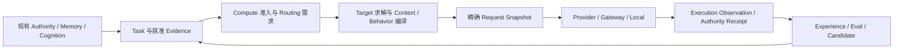

# 正式架构方向：连接权威、语义、计算与成长闭环

> D2 已更新职责、依赖与架构约束；API、字段清单、存储种类和代码目录仍按阶段冻结。
> 代码事实由 baseline 管理；用户选择和冻结状态由 decisions 管理。

## 1. 保持责任清楚，避免平行系统

沿用原研究的六个 Plane，但仅作为逻辑职责：

- Authority：Session / World / Studio 的正式结果、revision、lifecycle 与 receipts。
- Cognition：Actor 如何理解事件、持有哪些愿望 / 计划 / 情绪 / 关系 / 他者假设。
- Deliberation：现有 Runtime / Orchestrator / Tasks，以及后续 counterfactual、fast / slow 和计算分配。
- Experience：执行历史、反馈、评价、候选、晋升和撤回。
- Expression：同一 communicative intent 如何成为 prose、语音、图像或 Avatar。
- Interop：provider / 外部协议 / 训练的 adapter。

不先搬迁现有源码。Authority 写入仍经过 SessionCore / Studio；调度仍由 NativeTaskScheduler 与既有 lifecycle durable intent 承担；Memory 仍由现有 Memory OS / Graph 承担。

### 统一请求链路

Target 限制与 Context 精确编译有有界复核，不是无限循环。正常选择、FailurePolicy 与候选晋升分别拥有契约。六个 Plane 共享下列三个领域模块，不另加同名 authority：

- [behavior-context](behavior-context.md)：语义与编译、身份 / cognition / expression / narration 分离。
- [compute-policy](compute-policy.md)：稀疏调用、预算准入、非阻塞维护与收益。
- [model-routing](model-routing.md)：boundary / deployment / identity、动态证据与真实执行观察。

这些模块是相应细则的唯一来源；本文件继续管理跨 Plane 的连接。

## 2. 最小公共证据与 artifact 语义

建议将“统一”限定为同一套**可验证的引用与消费语义**，并允许源域不同：

- 主体：authenticated owner、project / session / actor / package 等精确身份。
- 来源：producer、run / request / effect、原始 source refs；模型不能填写可信 host 字段。
- 版本：source domain 及其精确 revision / branch / scope epoch / dependency fingerprint。
- 内容：schema、representation、受限 payload 或 opaque ref；content hash 与长度预算。
- 生命周期：current / stale / superseded / unavailable 等状态，按源 authority 重新判断。
- 消费：谁可读、用途、是否需要展开、是否可重复使用；引用不能自己赋予 mutation 权限。

**不把所有 revision 强行合成一个数字。** Studio Project revision、Native Session revision、PackageVersion、Prompt revision、Skill content hash、Runtime graph revision 有不同意义。
引用通过对应 source adapter 校验，不允许凭“同一 branch 名称”或显示名称证明数据仍有效。
普通 RP chat / message variant 的来源与 Native Session、Studio Project 分域；没有 Native branch / revision 的入口不伪造这些字段，使用自身可验证的 source anchor。

首批只实现证据集合、评测结果和真实 candidate consumer 需要的类型。
保留 engine result / Task Artifact 的原有契约；先做 adapter，再按确实重复的语义抽取共用纯校验器。
Artifact Bus 不是新的 World authority，也不默认是分布式消息中间件。

## 3. 轨迹与长期经验分离

需要区分三种现有 / 新增用途：

1. Runtime checkpoint：保证 pending effect、版本和取消能恢复。
2. UI projection：受限的当前运行状态，适合显示与调试。
3. Experience evidence：在有限保留期限内保存可归因的 inputs / observations / actions / outputs / receipts / feedback / cost。

Experience 使用既有 Host StorageEngine 的明确资源契约，不能把全部模型 chunk 写为 Session revision，也不能依赖 IndexedDB recovery 的 24 小时 prune。
两个入口各自捕获，然后输出公共 evidence envelope；它不是新的执行配置读取权威。

捕获先解决 parent / child、request / retry、effect、message variant、正式 outcome 的关联和幂等写入。执行快照与响应观察分开，沿原 request identity 关联 target、observable model、usage 完整性与预算 charge；具体语义由 model-routing / compute-policy 管理。
无法取得 provider usage、正文或旧来源时显式记录 missing / unavailable；不能伪造完整性。
默认只保存获准的必要内容；Secret、transport header、模型不可见的私有 reasoning 不进入共享轨迹。
删除来源、角色 / 项目或关闭采集后如何保留、清除与失效，在首批设计中明确。

## 4. Experience → Evolution

观察、反馈、诊断、候选和发布版本分别存储：

- regenerate / swipe / edit / cancel 是观察，具体含义待解释。
- critic / tool error / compiler failure 是对应技术信号，不等价为用户文风偏好。
- explicit preference、人工接受 / 拒绝、authority outcome 各有自己的来源与适用维度。
- 一条 lesson 需要有适用条件、来源、反例、失效条件和容量策略。
- 候选从原版本建立，在隔离案例执行；多个 authority 的候选先分别归因，再做组合回归。
- 晋升写回现有 Skill / Prompt / Preset 的允许路径，run 固定版本；Experience 只记录发布关系和证据。
- rollout / judge / training feedback 不回写真实 Memory、World 或正式用户偏好。

推荐第一批覆盖 Skill、Prompt、现有可配置编排策略，但分阶段接入。
用户已选择首批包含受预算与回滚约束的局部自动启用。具体发布状态机、门槛和恢复见 [m1-evolution.md](m1-evolution.md)；超出已声明范围的变更继续审阅。
Package 已安装资源不能被原位“成长”；作者副本或明确的 Host binding 选择才能生效。

## 5. Persistent Goal：用户执行契约与角色愿望

建议建立三个明确的概念域：

| 概念 | 主体与来源 | 完成 / 更新方式 |
| --- | --- | --- |
| User / Project execution goal | 用户发起或明确允许的 Agent 工作 | 正式产物与固定 verification surface |
| Actor goal / desire / intention | 角色认知；来源为事件、设定或受控提炼 | Actor 可见事件、状态变化与有限认知更新 |
| Run todo / commitment / open loop | 当前执行计划或叙事提醒 | 继续使用现有语义，与长期 Goal 做显式关联 |

Goal 需要可核对的 criteria、invariants、evidence、progress、blockers、预算和用户控制。
一次 run complete、模型自称成功或远程 Agent complete 不能单独宣布 Goal 完成。

Native Goal continuation 使用已持久化的 wake intent，再交给现有 scheduler。Project continuation 先补持久任务与幂等结果。
首次实现优先事件驱动；进程关闭期间的 wall-clock wake 不是现有 TaskScheduler 已有能力，若产品需要必须单独设计 Host lifecycle。
fork / rollback 后应重验 evidence，关闭旧 branch 的 pending continuation，避免旧目标重复执行写操作。

## 6. Actor cognition：状态可以真实存在，内容可以是错误解释

Actor identity / stable traits / expression style 属于作者定义或明确选择的精确资源；动态 cognition 属于 session / actor / branch。
不强制将旧 character profile 一次性转换成固定心理学数值表。

推荐从已有 Information 的 belief / perspective 接入：

`可见 Event → Appraisal proposal → 受控采纳的 Belief / Emotion / Relationship / Intention 更新 → 后续行为`

每项更新绑定 actor、source refs、base revision、model / profile revision；保留旧值和撤回依据。
动态更新事件驱动；默认读取已有 state，必要时一个获准 cognition pass 共享相关派生输出，各 authority 分别采纳。M3 消费 G01–G06 的预算、Context、路由与证据，不每新增一种心理概念就固定增加一次模型调用。

“Actor A 怀疑 B 背叛”与“B 已背叛”必须分域。关于 B 的心理推断留在 A 的 ToM，不作为 B 的私有真实状态。
稳定性格变更与短期情绪变化不能使用相同默认节奏或权限。

先支持一阶 ToM，再以有限深度支持二阶；限制节点、引用、展开、更新频率与计算预算。
confidence 默认是模型 / 策略的相对置信表达；未校准前不能当成客观概率。

## 7. 知识边界与 Memory applicability

确定性边界：Actor / task 只能取得允许的投影、Knowledge、Memory ref 和 tools；任何正式世界修改必须有 authority receipt。
概率性边界：自然语言 claim 是否偷用了模型参数中的世界外知识，需要 audit、修订、对照场景与评价。
实现时分别标明这两种保证，不承诺完全阻止自由文本幻觉。

Memory 继续回答发生过什么；cognition 决定本轮如何解释与使用。
检索后的 applicability 要考虑 Actor exposure、时间、branch、source 修订、例外和当前 Goal；失败时能放弃旧经验。
不将所有 actor 模型状态作为 Memory 的“事实”无差别注入其他角色。

## 8. Counterfactual 与 metacognition

预演输入使用 exact snapshot / views；输出是假设 artifact，携带 assumptions、预测 delta、支持 refs 和 uncertainty。
deterministic dry-run 与语言 / 视觉 World Model 是不同 provider 能力。
只选中的 action proposal 进入原 authority；所有 rollout 禁止自动 publication、生产工具副作用和真实记忆提取。

调用准入、稀疏事件 gate 与全量费用记录提前由 M1 / G05 提供；不等到 S26 才限制新认知层开销。先以固定 branch / step / token 预算证明选行动的收益，再加入 adaptive controller。
controller 先调 optional scout、retrieval depth、candidate count、critic rounds 和已授权模型 route；必要权限 / authority / knowledge guard 保留。
规则 controller 是基线；只有数据证明小模型 / 主模型 controller 有收益时才启用。
fast / slow 除开销外也有时序：异步 slow result 必须核对 revision，不能覆盖新回合的 state。

## 9. Expression、protocol 与 training

Identity / Cognition / Character Expression / Narration 的职责先由 behavior-context 固定；ExpressionPlan 先由现有 prose consumer 实际使用，再按 provider 支持增加 prosody、timing、gesture 等内容。
多模态 task 继续复用取消、预算、task artifact 与 provider capability；拒绝不支持能力时保留可用文字输出。

MCP / A2A / AG-UI / A2UI / MCP Apps adapter 固定支持版本、认证来源、scope、cancel 与结果映射。
外部 payload 是数据；外部 resource / Task 完成不获得本地写权限或 Goal 完成权。

Training export 分清 observation / action / receipt / preference / reward，标注缺失、衍生标签和可导出权限。
训练、prompt 优化或 model selection 的结果都必须重新经过同一 evaluation / promotion 路径。
latent / opaque representation 只有在 provider 真实暴露并通过兼容测试时才能实现；JSON-safe persistence 不能保存任意模型进程对象。

## 10. 成功的具体表现

- 同一项目 Agent 重启后知道剩余目标、精确配置和已提交产物，不重复提交旧操作。
- 同一角色跨回合保留自己的误会、承诺与关系变化；另一角色没有自动获得其秘密。
- 某次纠正产生可审阅规则，独立案例证明有帮助后进入后续 run，且能够停用 / 撤回。
- 高影响行动可以比较有限未来；普通 RP 以一次主要 generation 为目标，功能数量不变成固定调用数量，质量底线不因预算策略下降。
- 相同创作意图可由不同 target 编译；gateway 上游未知时如实报告，全部可观察重试、后台及 controller 开销能归因。
- 换模型、加入语音或远程 Agent 时，身份、世界、证据与用户控制仍由现有 Atria 路径承载。
