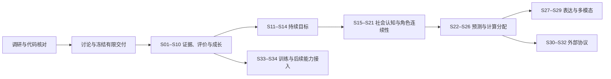

# Atria Agent Intelligence Runtime — 讨论与阶段入口

- Task ID: `agent-intelligence-runtime`
- Primary Workspace: `main`
- Status: **Draft / Discussion**；本入口尚未批准产品实现。
- Updated: 2026-10-06
- Inspected product HEAD: `ed1fd90521a63363e29856601abbf5e908c99d10`
- Source research: [Frontier Agent RP 调研](../agent-intelligence-research.md)
- Record: [阶段记录](../../../records/refactor/agent-intelligence-runtime.md)

## 目标与当前结论

把 Atria 已有的执行、记忆、世界权威与编排能力连接为持续智能体闭环：

`观测与证据 → 认知／目标 → 决策与执行 → 正式结果 → 评价与经验 → 经验证的改进`

**角色 RP 与 Project Agent 并重**是用户在本次对话中明确确认的产品选择。
两条入口共享证据、评价、目标和改进契约，各自保留当前写入权威、运行入口与产品体验。

主线不是缺一种编排模式。当前最重要的缺口是跨运行的可信证据与评价、持久目标、可追溯的角色认知，以及它们与既有 authority 的连接。
建议先完成两条入口都能实际使用的 Experience / Eval / Evolution 交付，再进入目标和社会认知。前沿技术通过后续有消费者的 adapter 接入。

## 已确认与未冻结

已确认：先调研、讨论、定案、执行；RP 与 Project Agent 并重；首批 Skill / Prompt / 编排参数成长闭环包含有预算与回滚约束的局部自动启用；M1 完整交付后集成，再从最新 main 继续。

以下仍是工程建议：首批交付范围、自动化程度、作用域、认知更新权限、预算、具体 schema、模块路径与验收阈值。
原研究和本 Bundle 都不能被当作自动开始实现的授权。决策状态只由 [decisions.md](decisions.md) 管理。

## 模块图与阅读路由

| 模块 | 唯一详细职责 | 依赖 |
| --- | --- | --- |
| [baseline.md](baseline.md) | main 的代码事实、接入点、现有测试与缺口 | inspected HEAD |
| [research.md](research.md) | 一手资料复核、证据边界、原研究需要收窄的推论 | 原研究、baseline |
| [architecture.md](architecture.md) | 责任、持久化、revision、认知与世界边界的候选设计 | baseline、decisions |
| [delivery.md](delivery.md) | 34 个候选实施阶段、依赖、实际交付与验收 | architecture、research |
| [decisions.md](decisions.md) | 本对话已确认选择、推荐方案、待讨论和批准记录 | index |
| [m1-evolution.md](m1-evolution.md) | 首批双入口成长、局部自动启用与恢复的具体讨论设计 | architecture、decisions |

当前 D0 / D1 读本入口、decisions 和 delivery；收敛首批时读 m1-evolution。需要核对事实时读 baseline；讨论对应技术时按 research 的资料分组阅读。
后续阶段的最小读取集合由 delivery 路由，不要求每次重新加载整份原始研究或全部 Bundle。

## 阶段图

图中是建议的产品演进路线，不是已冻结的执行次序。精确依赖见 delivery；M5、M6、M7 可以在满足自身依赖后调整顺序。
远期技术成熟度不构成第一批产品交付的隐含依赖。

## 当前状态

| Checkpoint | 状态 | 产物 |
| --- | --- | --- |
| D0 — 重新调研 | 已完成本轮架构覆盖；进入讨论 | 代码审计、一手资料复核、34 阶段讨论稿 |
| D1 — 确定方案 | 首批范围与集成策略已确认；技术细则待收敛 | 固定权限、双场景验收、预算和首阶段执行设计 |
| S01–S34 | 未开始；均为候选 | 不将研究性接口或预留字段计为能力落地 |

本轮没有改动产品源码。实施分支尚未创建；候选名称为 `feat/agent-intelligence-runtime`。
发现的既有未提交 Experience 草稿已保留，其处理方式在 decisions 中明确为待整合事项。

## 验证与交付原则

- 先验证来源、隔离、失效、恢复、写入权限和版本固定，再评价模型效果。
- 确定性结构检查、真实 outcome、行为轨迹、成本、人工偏好分别记录；单一 judge 分数不能宣布所有维度通过。
- 两条路径的运行方式不同，必须各自走端到端闭环；共享一个 schema 不等于已经集成。
- 每阶段包含可用消费者、针对性测试、兼容与撤回路径；涉及 UI 时在真实浏览器检查相关状态。
- 按 Repository Governance，在正式阶段结束时持久化、更新同一 Record / live HANDOFF、给出接手提示词并停止；按用户确认在完整交付组后集成 main，长期记录持续。
- D1 必须冻结一个有限交付范围及其集成点；后续路线按证据扩展，避免无限研究目标使稳定产品一直无法交付。

## 进入正式实施的条件

1. 讨论 decisions 中的产品边界，记录用户确认或调整。
2. 明确首批阶段、双场景验收案例、基线、资源预算和主线集成点。
3. 补齐首个实施阶段需要的具体契约、迁移、权限和失败处理，并将对应设计标为 Approved。
4. 重新 fetch / 核对 main；只复核受变化影响的代码与模块。
5. 以确认后的有限范围创建产品分支；不因远期阶段已列出而跨越正式阶段边界。
