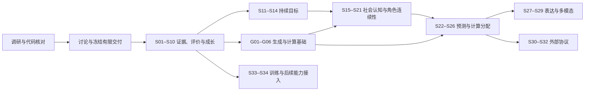

# Atria Agent Intelligence Runtime — 正式架构与阶段入口

- Task ID: `agent-intelligence-runtime`
- Primary Workspace: `main`
- Status: **D2 architecture revised / M1 boundary frozen / S01 structural complete / S02 next**；新增生成基础组与远期技术契约按阶段细化。
- Updated: 2026-10-06
- S01 implementation / baseline Tested HEAD: `0a41023ef6689b8b80ca64ffdd5cda72838897fe`；`feat/agent-intelligence-runtime` 已 push，尚未合并 main。
- Inspected product HEAD: `ed1fd90521a63363e29856601abbf5e908c99d10`
- Source research: [Frontier Agent RP 调研](../agent-intelligence-research.md)；[Prompt / Context](../model-prompt-context-frontier-research.md)、[Sparse AI / Compute](../sparse-ai-invocation-adaptive-compute-research.md)、[Model / Provider / Routing](../model-provider-routing-frontier-research.md)
- D2 source docs HEAD: `40ce08a32`；产品基线未变化。
- Record: [阶段记录](../../../records/refactor/agent-intelligence-runtime.md)

## 目标与当前结论

把 Atria 已有的执行、记忆、世界权威与编排能力连接为持续智能体闭环：

`观测与证据 → 认知／目标 → 决策与执行 → 正式结果 → 评价与经验 → 经验证的改进`

**角色 RP 与 Project Agent 并重**是用户在本次对话中明确确认的产品选择。
两条入口共享证据、评价、目标和改进契约，各自保留当前写入权威、运行入口与产品体验。

D2 将三份研究纳入同一正式架构：稳定 Behavior / Creative 语义、受权限控制的 Context、稀疏计算准入、请求时 Routing 求解与精确执行证据共同服务该闭环。架构层不等于模型调用层，ordinary RP 以一次主要正文调用为目标，额外计算必须有触发证据与预算。

主线不是缺一种编排模式。当前最重要的缺口是跨运行的可信证据与评价、持久目标、可追溯的角色认知，以及它们与既有 authority 的连接。
建议先完成两条入口都能实际使用的 Experience / Eval / Evolution 交付，再进入目标和社会认知。模型 / 网关 / 计算基础以新增有限交付组 M8（G01–G06）补齐，之后社会认知与预测消费共享 substrate；前沿技术通过有消费者的 adapter 接入。

## 已确认与未冻结

已确认：先调研、讨论、定案、执行；RP 与 Project Agent 并重；首批 Skill / Prompt / 编排参数成长闭环包含有预算与回滚约束的局部自动启用；M1 完整交付后集成，再从最新 main 继续。

D1 已确认逐角色 / Project 开启局部自动，新建对象默认审阅，共用 owner 级有限预算。M1 产品边界与架构执行约束已冻结，S01 设计就绪。
后续物理 schema、具体预算 / 阈值、迁移和 M2 以后认知权限按对应阶段深化；决策状态只由 [decisions.md](decisions.md) 管理。四份研究仍为非约束性材料。D2 是本轮授权的企划更新，不把研究中的统计数字、候选名称、Provider 支持或新自动化权限当作用户批准；G01–G06 未实施。

## 模块图与阅读路由

| 模块 | 唯一详细职责 | 依赖 |
| --- | --- | --- |
| [baseline.md](baseline.md) | main 的代码事实、接入点、现有测试与缺口 | inspected HEAD |
| [research.md](research.md) | 一手资料复核、证据边界、原研究需要收窄的推论 | 原研究、baseline |
| [architecture.md](architecture.md) | 六 Plane 与语义 / 计算 / 路由连接、证据与认知边界 | baseline、decisions |
| [delivery.md](delivery.md) | 40 个候选实施阶段、依赖、实际交付与验收 | architecture、research |
| [decisions.md](decisions.md) | 本对话已确认选择、推荐方案、待讨论和批准记录 | index |
| [m1-evolution.md](m1-evolution.md) | 首批双入口成长、局部自动启用与恢复的具体讨论设计 | architecture、decisions |
| [s01-baseline.md](s01-baseline.md) | S01 的具体案例、报告契约、预算、验证和退出条件 | decisions、当前代码入口 |
| [behavior-context.md](behavior-context.md) | Behavior / Creative / Context / Generation 分层、语义编译、overlay、压缩与迁移 | 当前 Prompt / Context substrate |
| [compute-policy.md](compute-policy.md) | sparse 默认路径、共享 cognition、硬预算、后台分流与计算收益评价 | TaskScheduler / RunControl、M1 Eval |
| [model-routing.md](model-routing.md) | Connection / Target / Identity、动态 evidence / policy / resolver、gateway、恢复与执行观察 | 既有 resolver / provider ports、前两模块 |

已完成 S01 的读取路由为本入口 → decisions → s01-baseline → Record；下一 S02 读取 decisions / m1-evolution / delivery S02 / baseline 相关接入 → Record；按问题读取 m1-evolution / baseline。D0 / D1 / D2 已完成；S01 补充测量说明不扩张其 12 cases 与 test-only 范围。无需重新进行全量调研。
后续阶段的最小读取集合由 delivery 路由，不要求每次重新加载整份原始研究或全部 Bundle。

## 阶段图

图中是建议的产品演进路线，不是已冻结的执行次序。精确依赖见 delivery；M5、M6、M7 可以在满足自身依赖后调整顺序。
保留 S01–S34 身份，新增 G01–G06 共 40 个候选实施阶段。建议 M1 → M2 → M8 → M3 → M4；M8 与 M2 没有必然先后依赖，可在本组设计时调整，M3 前必须有已验收生成基础。M1 不等待 M8，也不在 S01 中实现动态路由。
远期技术成熟度不构成第一批产品交付的隐含依赖。

## 当前状态

| Checkpoint | 状态 | 产物 |
| --- | --- | --- |
| D0 — 重新调研 | 已完成本轮架构覆盖；进入讨论 | 代码审计、一手资料复核、34 阶段讨论稿 |
| D1 — 确定方案 | 已完成本轮冻结 | 默认模式、scope / budget / publication 约束、S01 执行设计 |
| D2 — 三份研究综合更新 | 本轮完成 | 三个权威模块、六个基础阶段、依赖与评价 / 测量补充 |
| S01 | Structural / scripted complete；empiricalReady=false | 12 cases、双入口 runner、strict v1 consumer / sidecar、有限预算与缺失状态；实际验证见 Record |
| S02–S34 / G01–G06 | 未开始；按阶段深化 | 不将研究性接口或预留字段计为能力落地 |

S01 只新增 test-only 文件；`feat/agent-intelligence-runtime` 已实现 / push，main 未变化。当前阶段结束停止，下一正式阶段 S02；没有执行真实模型或后续阶段。
发现的既有未提交 Experience 草稿已保留，其处理方式在 decisions 中明确为待整合事项。

## 验证与交付原则

- 先验证来源、隔离、失效、恢复、写入权限和版本固定，再评价模型效果。
- 确定性结构检查、真实 outcome、行为轨迹、成本、人工偏好分别记录；单一 judge 分数不能宣布所有维度通过。
- 两条路径的运行方式不同，必须各自走端到端闭环；共享一个 schema 不等于已经集成。
- 每阶段包含可用消费者、针对性测试、兼容与撤回路径；涉及 UI 时在真实浏览器检查相关状态。
- 按 Repository Governance，在正式阶段结束时持久化、更新同一 Record / live HANDOFF、给出接手提示词并停止；按用户确认在完整交付组后集成 main，长期记录持续。
- D1 必须冻结一个有限交付范围及其集成点；后续路线按证据扩展，避免无限研究目标使稳定产品一直无法交付。

## 进入正式实施的条件

产品范围与 S01 结构交付已就绪；下一轮复核真实 Git，继续同一本组产品分支，仅执行 S02。先按 m1-evolution / delivery / baseline 细化来源与有效性最小契约；只复核变化影响的代码，不重新询问已确认的范围与默认方式。
S01 不新增产品存储契约，迁移为无；S02 等后续阶段引入资源前必须补齐其详细校验 / 迁移 / 失败处理。
每个正式阶段完成后按治理停止；不能因远期路线已列出而自动跨越阶段边界。
