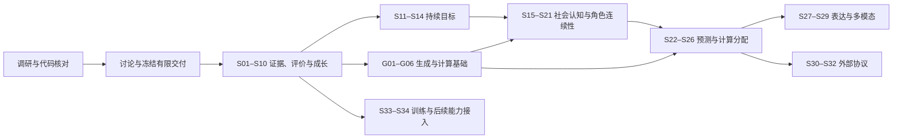

# Atria Agent Intelligence Runtime — 正式架构与阶段入口

- Task ID: `agent-intelligence-runtime`
- Primary Workspace: `main`
- Status: **M1 boundary frozen / S01 structural complete / S02 complete / S03 complete / S04 complete / S05 complete / S06 complete / S07 complete**；D3 Reasoning Continuity 与 D4 Execution Reuse / Cache Locality / Adaptive Invocation 企划整合完成；生成基础组与远期技术契约按阶段细化。
- Updated: 2026-10-06
- S01 implementation / baseline Tested HEAD: `0a41023ef6689b8b80ca64ffdd5cda72838897fe`；`feat/agent-intelligence-runtime` 已 push，尚未合并 main。
- S02 implementation / Tested HEAD: `072a15d8d5b51117d0c5442e48e345475a274b66`；沿用同一任务分支，已 push，main 未变化。
- S03 implementation / Tested HEAD: `78acfb65da6b1afa1dee1c2f35482af215832c74`；沿用同一任务分支，已 push，main 未变化。
- S04 implementation / Tested HEAD: `172a0c281334c36c56273a24d19922ad4d5e5c35`；沿用同一任务分支，已 push，main 未变化。
- S05 implementation / Tested HEAD: `caf662842941d3261dc1840242278f5529db10af`；同一任务分支已 push，main 未变化。
- S06 implementation / local Tested HEAD: `54c79cb8eea7d6ca5c7e5e4ff262fe0ca6666a64`；六槽真实基线 / 六对独立比较已完成，101 distinct local tests；typed judge五个有效观察 / 一个无效响应，候选仍 promotion ineligible。实际模型报告 pin 各自 tested HEAD / source bytes，见 Record。
- S07 implementation / local Tested HEAD: `57f4e814af373b4659ba247f9891edd80652c356`；完整 Skill snapshots / candidates / CAS 与真实读取 pin；13 relevant suites / 247 distinct tests，未执行真实模型或自动 publication。
- Inspected product HEAD: `ed1fd90521a63363e29856601abbf5e908c99d10`
- Source research: [Frontier Agent RP 调研](../agent-intelligence-research.md)；[Prompt / Context](../model-prompt-context-frontier-research.md)、[Sparse AI / Compute](../sparse-ai-invocation-adaptive-compute-research.md)、[Model / Provider / Routing](../model-provider-routing-frontier-research.md)、[Reasoning Continuity](../reasoning-continuity-research.md)、[Execution Reuse / Cache Locality / Adaptive Invocation](../execution-reuse-cache-locality-adaptive-invocation-research.md)
- D2 source docs HEAD: `40ce08a32`；产品基线未变化。
- D4 source docs HEAD: `1c2502dae8ac1bcb7a0bb1dfb1e18d9f01b984b8`；研究源提交 `aa4d2d2fe`，S03 产品 HEAD 与 main 未变化。
- Record: [阶段记录](../../../records/refactor/agent-intelligence-runtime.md)

## 目标与当前结论

把 Atria 已有的执行、记忆、世界权威与编排能力连接为持续智能体闭环：

`观测与证据 → 认知／目标 → 决策与执行 → 正式结果 → 评价与经验 → 经验证的改进`

**角色 RP 与 Project Agent 并重**是用户在本次对话中明确确认的产品选择。
两条入口共享证据、评价、目标和改进契约，各自保留当前写入权威、运行入口与产品体验。

D2 将三份研究纳入同一正式架构：稳定 Behavior / Creative 语义、受权限控制的 Context、稀疏计算准入、请求时 Routing 求解与精确执行证据共同服务该闭环。架构层不等于模型调用层，ordinary RP 以一次主要正文调用为目标，额外计算必须有触发证据与预算。

D3 将 Reasoning Continuity 纳入现有 Runtime 的可选执行能力，沿 Provider Adapter、Capability Evidence、Effective Execution Plan / Snapshot 与 ExecutionObservation 管理，详细规则唯一归属 [model-routing §7](model-routing.md#7-reasoning-continuity执行状态与生命周期)。它保留兼容路径的不透明状态；长期成果走显式 artifact 原契约，Planner 与 Narrator 分别评价目标连续和表达新鲜。

D4 将已完成工作的有效复用、稳定 Context 与缓存局部性接入同一链路：[execution-reuse](execution-reuse.md) 唯一管理 Reuse Contract / validity proof / dependency invalidation 与 Tool / Plan 消费；[behavior-context §3.1 / §4](behavior-context.md#31-稳定-context-segment-与-cache-aware-compiler) 管理 Segment identity / canonical compiler；[compute-policy §1.1](compute-policy.md#11-adaptive-invocation-决策阶梯) 管理按需执行；[model-routing §8](model-routing.md#8-cache-capability与cache-locality) 管理三层 cache capability / locality 与可观察执行。相似度只找候选，原 authority 证明当前适用；RP 复用前置 facts / plan / intent 并 fresh-generate 正文。Execution Continuation 引用 D3，详细定义不重复。

主线不是缺一种编排模式。当前最重要的缺口是跨运行的可信证据与评价、持久目标、可追溯的角色认知，以及它们与既有 authority 的连接。
建议先完成两条入口都能实际使用的 Experience / Eval / Evolution 交付，再进入目标和社会认知。模型 / 网关 / 计算基础以新增有限交付组 M8（G01–G06）补齐，之后社会认知与预测消费共享 substrate；前沿技术通过有消费者的 adapter 接入。

## 已确认与未冻结

已确认：先调研、讨论、定案、执行；RP 与 Project Agent 并重；首批 Skill / Prompt / 编排参数成长闭环包含有预算与回滚约束的局部自动启用；M1 完整交付后集成，再从最新 main 继续。

D1 已确认逐角色 / Project 开启局部自动，新建对象默认审阅，共用 owner 级有限预算。M1 产品边界与架构执行约束已冻结，S01 设计就绪。
后续物理 schema、具体预算 / 阈值、迁移和 M2 以后认知权限按对应阶段深化；决策状态只由 [decisions.md](decisions.md) 管理。六份研究是来源材料；被正式采纳的架构约束由 decisions / 对应模块管理，其余研究建议不构成实施批准。D2 / D3 / D4 只授权企划更新，不把研究中的统计数字、示例 schema、候选名称、Provider 支持或新自动化权限当作用户批准；G01–G06 未实施。

## 模块图与阅读路由

| 模块 | 唯一详细职责 | 依赖 |
| --- | --- | --- |
| [baseline.md](baseline.md) | main 的代码事实、接入点、现有测试与缺口 | inspected HEAD |
| [research.md](research.md) | 一手资料复核、证据边界、原研究需要收窄的推论 | 原研究、baseline |
| [architecture.md](architecture.md) | 六 Plane 与语义 / 复用 / 计算 / 路由连接、证据与认知边界 | baseline、decisions |
| [delivery.md](delivery.md) | 40 个候选实施阶段、依赖、实际交付与验收 | architecture、research |
| [decisions.md](decisions.md) | 本对话已确认选择、推荐方案、待讨论和批准记录 | index |
| [m1-evolution.md](m1-evolution.md) | 首批双入口成长、局部自动启用与恢复的具体讨论设计 | architecture、decisions |
| [s01-baseline.md](s01-baseline.md) | S01 的具体案例、报告契约、预算、验证和退出条件 | decisions、当前代码入口 |
| [s02-sources.md](s02-sources.md) | S02 最小 source / reference / validity、预算与无迁移边界 | m1-evolution、当前 authority |
| [s03-capture.md](s03-capture.md) | S03 bounded RP trace / EvidenceRecord、key / CAS、outcome / output binding、迁移与缺失边界 | s02-sources、原 StorageEngine / authority |
| [s04-project-recovery.md](s04-project-recovery.md) | S04 持久 Project task / attempts / public conversation、正式 Git receipt、容量 / restart / conflict / delete | s02-sources、s03-capture、原 Studio / StorageEngine |
| [s05-feedback.md](s05-feedback.md) | S05 feedback / diagnosis 分层、subject / exact source、撤回 / 删除 / 导出、retention / reflection batch | S02–S04 与原 StorageEngine / authority |
| [s06-comparison.md](s06-comparison.md) | S06 隔离比较 / explicit live bridge / 共享累计预算 / 真实执行与保守晋升状态 | S01、S05、原 Workspace / Session / generation |
| [s07-skills.md](s07-skills.md) | S07 原 Skill repository immutable snapshots / candidates、完整 base conflict、真实 run pin / history / lifecycle | S06 与原 Skill authority |
| [behavior-context.md](behavior-context.md) | Behavior / Creative / Context / Generation 分层、语义编译、overlay、压缩与迁移 | 当前 Prompt / Context substrate |
| [compute-policy.md](compute-policy.md) | sparse 默认路径、共享 cognition、硬预算、后台分流与计算收益评价 | TaskScheduler / RunControl、M1 Eval |
| [model-routing.md](model-routing.md) | Connection / Target / Identity、动态 evidence / policy / resolver、gateway、恢复与执行观察、Reasoning Continuity、cache capability / locality | 既有 resolver / provider ports、Context / Compute / Reuse 契约 |
| [execution-reuse.md](execution-reuse.md) | 复用定义 / proof、依赖级失效、Tool / Artifact / Plan / Workflow / Narrative Intent 消费、Trust Domain 与评价 | 原 artifact / source / authority；Context / Compute / Routing 分别管理执行连接 |

已完成 S01–S07；来源、捕获、Project 恢复与反馈生命周期分别由 s02-sources / s03-capture / s04-project-recovery / s05-feedback 管理。S06 比较 / 真实执行与限制由 s06-comparison / Record 管理。下一 S08 读取本入口 → decisions → m1-evolution / delivery S08 / s07-skills 与 s06-comparison → Record；按需读取 baseline 的 Prompt / immutable binding 相关段落。D0–D4 已完成；D4 模块按 G 阶段路由，不成为 S06 新依赖。不重做全量研究，S01 12 cases / test-only 边界保持。
后续阶段的最小读取集合由 delivery 路由，不要求每次重新加载整份原始研究或全部 Bundle。

## 阶段图

图中是建议的产品演进路线，不是已冻结的执行次序。精确依赖见 delivery；M5、M6、M7 可以在满足自身依赖后调整顺序。
保留 S01–S34 身份，新增 G01–G06 共 40 个候选实施阶段。建议 M1 → M2 → M8 → M3 → M4；M8 与 M2 没有必然先后依赖，可在本组设计时调整，M3 前必须有已验收生成基础。M1 不等待 M8，也不在 S01 中实现动态路由。
远期技术成熟度不构成第一批产品交付的隐含依赖。
D4 的 Reuse semantics → Cache-aware context → Tool / Artifact → Plan / Workflow → Adaptive Invocation → Local optimization 映射见 [delivery §8.1](delivery.md#81-execution-reuse实施顺序与既有阶段映射)；前五项沿 G01–G06，Local KV / decode 在后续研究池，保持 40 个正式阶段身份。

## 当前状态

| Checkpoint | 状态 | 产物 |
| --- | --- | --- |
| D0 — 重新调研 | 已完成本轮架构覆盖；进入讨论 | 代码审计、一手资料复核、34 阶段讨论稿 |
| D1 — 确定方案 | 已完成本轮冻结 | 默认模式、scope / budget / publication 约束、S01 执行设计 |
| D2 — 三份研究综合更新 | 本轮完成 | 三个权威模块、六个基础阶段、依赖与评价 / 测量补充 |
| D3 — Reasoning Continuity 架构整合 | 本轮完成 | 既有术语归并、opaque execution / lineage / loss、G01–G06 实施映射与评价边界 |
| D4 — Execution Reuse / Cache Locality / Adaptive Invocation 整合 | Complete；本轮仅企划 | 复用契约、Segment / canonical compiler、按需调用、路径 cache evidence 与 A–F 映射；continuation 沿 model-routing §7 |
| S01 | 原结构阶段 complete；S06 live pilot empiricalReady=true | 12 cases、双入口 runner、strict v1 consumer / sidecar、有限预算与缺失状态；实际验证见 Record |
| S02 | Complete；只读来源契约与 consumer | 双域 adapter、EvidenceSet / Evaluation v1；43 新增 / 17 既有 tests 通过；无持久资源或迁移 |
| S03 | Complete；可靠 RP 捕获与公共持久层 | bounded metadata、run / request / attempt / variant、Native receipt、FS / SQLite durable CAS 与 authenticated consumer；验证见 Record |
| S04 | Complete；Project 持久任务与恢复 | FS / SQLite task / attempts / conversation、正式 Studio Git receipt、保存失败恢复 / stale conflict；9 suites / 165 distinct tests 与本地 Chromium fixture 通过 |
| S05 | Complete；双入口反馈与诊断生命周期 | exact source / subject、CAS、纠正 / 撤回 / 删除 / 导出、retention / reflection；5 suites / 137 tests |
| S06 | Complete；隔离 evaluator 与真实执行 checkpoint | 六槽 pilot / 六对独立比较全部 execution / authority passed；5 model observations / 1 invalid response；候选晋升 ineligible |
| S07 | Complete；原 Skill authority candidate / version / read pin | full-file history、正文候选 / whole-base CAS、RP shared run / Native / Studio exact consumers；13 suites / 247 tests |
| S08–S34 / G01–G06 | 未完成正式交付；按阶段深化 | 不将研究性接口或预留字段计为能力落地 |

S01 是 test-only 基线；S02 是生产只读来源 consumer；S03 接入 Runtime / Native Host 自动 metadata 捕获、持久 repository 与 authenticated HTTP consumer。Director 输出仅绑定原 chat 已保存的 exact variant；capsule-only / legacy 无 ID / 未绑定输出明确 incomplete，不宣称所有 RP 模式均有完整正文关联。S04 已将原 ProjectAgentService 任务写入 StorageEngine，恢复公开对话、Review 与正式 receipt；重启不自动 generation / rebase / commit。`feat/agent-intelligence-runtime` 已提交 / push，main 未变化。S05 已交付 authenticated feedback / technical outcome / diagnosis consumer、source invalidation、retention 与批次 gate；S06 已完成隔离比较、显式 live consumer 与真实运行验证；候选晋升仍拒绝，不声明稳定质量 / 成本收益。S07 已交付原 Skill authority完整版本与读取 pin；下一 checkpoint S08，本轮未开始。G 阶段 opaque checkpoint 与 reuse / cache 功能未实施。D3 / D4 决策与历史保留。
发现的既有未提交 Experience 草稿已保留，其处理方式在 decisions 中明确为待整合事项。

## 验证与交付原则

- 先验证来源、隔离、失效、恢复、写入权限和版本固定，再评价模型效果。
- 确定性结构检查、真实 outcome、行为轨迹、成本、人工偏好分别记录；单一 judge 分数不能宣布所有维度通过。
- 两条路径的运行方式不同，必须各自走端到端闭环；共享一个 schema 不等于已经集成。
- 每阶段包含可用消费者、针对性测试、兼容与撤回路径；涉及 UI 时在真实浏览器检查相关状态。
- 按 Repository Governance，在正式阶段结束时持久化、更新同一 Record / live HANDOFF、给出接手提示词并停止；按用户确认在完整交付组后集成 main，长期记录持续。
- D1 必须冻结一个有限交付范围及其集成点；后续路线按证据扩展，避免无限研究目标使稳定产品一直无法交付。

## 进入正式实施的条件

产品范围与 S01–S07 已就绪；下一轮复核真实 Git，继续同一产品分支，仅执行 S08。按 m1-evolution / delivery S08 / s07-skills / s06-comparison 与原 Prompt authority 细化可演化正文区块、candidate exact resource ref / diff、有效binding、Package兼容 / missing-version / conflict契约。S07 Skill版本已固定；S06真实执行已完成，候选仍promotion ineligible。S07未做新模型请求；若后续确需补测，只恢复既有有限累计ledger与ratecheckpoint，不用模型观察替代质量 / 费用门槛。
S08不能建立latest fallback或改写Package原版；依然沿原Prompt / Presetauthority。
每个正式阶段完成后按治理停止；不能因远期路线已列出而自动跨越阶段边界。
